**NPC Plugin Chooser 2**

# Description

This utility allows you to manage which mod provides the appearance of each NPC in the game. You can use it to easily mix-and-match appearance mods, avoiding face conflicts / dark face bugs.

## Why Does This Exist?

Let’s get this out of the way: Yes, I know [EasyNPC](https://www.nexusmods.com/skyrimspecialedition/mods/52313) exists. A bit of backstory: Back in 2021 I created the original [NPC Plugin Chooser](https://www.nexusmods.com/skyrimspecialedition/mods/49066), which was a Synthesis patcher or standalone command line program. N.P.C. was, for a time, included in [Lexy’s LotD](https://lexyslotd.com/), which I’m still very proud of.  Then, just a few months later, EasyNPC came out and its UI blew N.P.C. out of the water, so I let the project phase out into peaceful eternity… or so I thought.

In early 2025, I was reminiscing about the early days so I went back to look at the N.P.C. Nexus page and found something horrifying in the comments: My instructions had given someone an aneurysm. Even worse, another user chimed in and said they had one as well! I’ve always wanted to be helpful to the community and yet here I was, apparently laying ticking time bombs for unsuspecting users to stumble onto. I felt like I needed to make it right. There had always been a few features that I wished EasyNPC had (see below), but I always figured it’d be too much work to make a whole app just for those features. Fortuitously, right at that moment, someone on Discord was trying to convince me that LLMs could already make entire apps from scratch, so I figured this would be a perfect opportunity to test that claim (more on this below as well). And so N.P.C.2 was born. 

## Do I Need This?

If you’re already using EasyNPC and you’re happy with it, there’s not really any reason to switch. EasyNPC’s developer is much more experienced and meticulous than I am and you’re probably less likely to run into issues with it. But if you’re still looking to put together your NPC list, you might want to take advantage of some of the features here. Note that if you enjoy my UI but want to take advantage of EasyNPC’s well-tested code, N.P.C.2 has buttons to export to (and import from) EasyNPC.

## What Are The Features?

* Lets you select the source of each NPC’s appearance (just like EasyNPC and N.P.C.1)
* Lets you use a different NPC's appearance (just like my NPC Appearance Copier Synthesis Patcher), and even build a library of your favorite faces to reuse
* More flexible mod selection UI
    * Gallery view for NPC mugshots
    * You’re allowed to select mods even if you don’t currently have them installed - you can make your selections based on mugshots, and then download only those mods that you ended up choosing. 
    * Short (hopefully spoiler-free) description (base game NPCs only) to help you choose an appearance if you don’t know who they are. [Optional]
    * Quick full screen mugshot preview, plus an interactive 3D preview you can rotate and relight
    * Quick comparison button to compare a subset of available mugshots side-by-side
    * Drag-and-drop functionality to apply mugshots to a mod if their names don’t match
    * Drag-and-drop functionality to replace ModA with ModB wherever an NPC can choose from both
    * “Choose this mod for all NPCs it provides” button
    * Mod menu where you can see the mugshots of all NPCs within the mod
    * A Summary tab that shows all of your choices at a glance
* Generate your own mugshots
    * If a mod doesn’t ship mugshots, N.P.C.2 can render them for you using its built-in 3D renderer, or fetch them from the online FaceFinder service.
* Non-appearance override handling
    * If an NPC mod overrides records that aren’t typically associated with Appearance Replacers, such as Races, N.P.C.2 can handle that. 
* Not-In-Load-Order Mod Sources
    * I personally hate, hate, hate enabling and disabling plugins in my mod manager just for patching. So, NPC doesn’t require mods to be active in your load order. In fact, they don’t even have to be enabled at all. In fact, they don’t even have to be in the same mod manager installation. You can launch N.P.C.2 from C:\LoreRim, and tell it your mods folder is in C:\MO2InstallationForAppearanceMods\mods, and use those appearance mods to patch your LoreRim install.
* Create Mode
    * N.P.C.2 offers two modes: “Create”, or “Create And Patch”. “Create And Patch” is like EasyNPC: it patches your load order to your selected appearance mods. “Create” is how I used to like doing things: it ignores your load order and just splices together the mods you suggested exactly as they are. The idea is you treat the generated output just like you would any other appearance mod: put it up high in your plugin load order, low in your asset order, and then use something like Synthesis FaceFixer to forward the NPC appearances into your mod list. 
* SkyPatcher Mode
    * SkyPatcher is all the rage these days. I personally don’t think it’s a great idea to use for appearance mods because then you have to make exclusions for things like RSV or SynthEBD, but I know people would ask for it so I went ahead and included it. With SkyPatcher mode, N.P.C.2 applies its selections using SkyPatcher instead of modifying the NPC records (duh).
* Output Verification Tools
    * After you build your output you can run the Validator to confirm that the deployed result actually matches your selections, and Analyze Masters to see exactly why your output plugin depends on each of its masters.
* Group Splitting
    * You can assign NPCs to groups and only generate output for those groups. This can be useful if you get Too Many Masters errors and don’t want to switch to SkyPatcher mode. N.P.C.2 can also automatically split the output into multiple plugins by gender, race, or a maximum NPC count.
* Bat File Generation
    * You can quickly generate bat files to spawn all NPCs in your selected Group. This can be useful if you want to check and make sure they all look ok. 

# Installation

N.P.C.2 is theoretically compatible with both MO2 and Vortex, but I’ve only ever tested with MO2.

Install like you would any other similar utility such as EasyNPC. Extract the contents of the zip file to the location of your choice. Add the .exe as an executable in your mod manager, and run it from your mod manager.

## Basic Usage

> **First launch:** A splash screen appears while N.P.C.2 starts up. The **first** time you select a mods folder, N.P.C.2 analyzes every mod and builds a cache — this can take a while, so be patient. Every launch after that reuses the cache and is much faster.

1. Launch the .exe (through your mod manager).
2. In the **Settings** tab, set the Skyrim version that you’re patching from the dropdown.
3. If you’re using a non-standard data directory (e.g. RootBuilder or Stock Game), set its data folder as the Game Data Path.
4. Select your **Mods Folder** and wait for analysis to complete (this takes longer the first time you select the mods folder than in subsequent launches).
    * If MO2, this will be your mo2\mods folder.
    * If Vortex, this will be your staging folder.
    * The mods folder can be, but does not have to be, the same one that’s used by the mod manager you’re using to launch the .exe. It should be the one to which your appearance mods are installed. This can be a completely separate MO2 or Vortex directory if you so choose.
5. Select your **Mugshots Folder** and wait for the mugshots to be linked to your mods. (If you don’t have mugshots for some mods, N.P.C.2 can generate them — see [Mugshot Settings](#mugshot-settings).)
6. Select your **Output Directory**.
    * If you just type in a name, you’ll get that folder created as a subfolder within the mods folder from step 4.
    * If you want to specify a folder in a different mod manager, type in the full path (or browse & select it).
7. Switch to the **NPCs** tab and make your selections.
    * To select from an existing option, just click the Mugshot or Placeholder for your desired appearance mod. The border will turn green if the selection is valid.
    * To apply the appearance from a different NPC, right-click the mugshot you want and use **Share with NPC** (see [Sharing an Appearance Between NPCs](#sharing-an-appearance-between-npcs)).
8. Switch to the **Run** tab & run the patcher.
9. Enable the resulting plugin and assets in your mod manager. Make sure the assets overwrite all conflicts.

> **Recommended setup:** you can leave your appearance-overhaul mods **disabled** in your mod manager. N.P.C.2 reads the data and assets it needs straight out of disabled mods, and keeping them disabled stops their records from sneaking into your output as master dependencies. (See [Analyze Masters](#analyze-masters) for an example of what happens when an overhaul is left active.)

# Detailed Usage

The app is organized into five tabs along the top: **NPCs**, **Mods**, **Summary**, **Settings**, and **Run**. The first time you launch, you’ll land on the Settings tab, which is where you tell N.P.C.2 about your setup.

## Settings Menu

This is where you point N.P.C.2 at your game and your mods, and configure how it generates output and displays mugshots.

### Game Environment

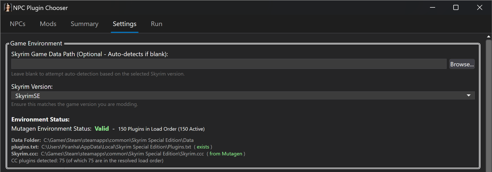

These settings tell the program how your Skyrim installation is set up.

* **Skyrim Game Data Path**: Leave this blank for a standard Steam install — N.P.C.2 will auto-detect it. If your game is in a non-standard location (Stock Game, Root Builder, etc.), point the **Browse...** button at your `Data` folder.
* **Skyrim Version**: Pick the edition you’re patching (e.g. SkyrimSE, SkyrimVR). Make sure this matches the game version you’re modding.
* **Environment Status**: A live readout confirming that N.P.C.2 found a valid environment — the number of plugins in your load order, your data folder, your `plugins.txt`, and how many Creation Club plugins were detected. If something is wrong here, fix it before doing anything else.

### Mod Environment

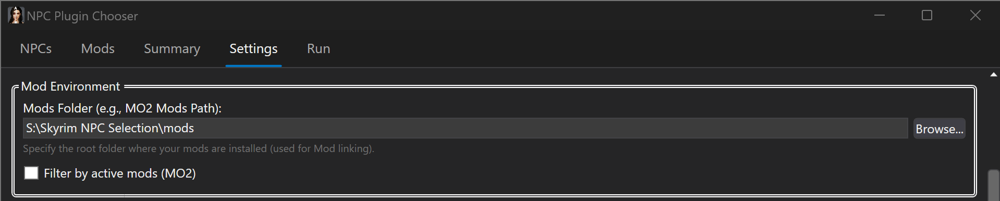

Here you tell N.P.C.2 where to find your appearance mods.

* **Mods Folder**: The root folder where your mods are installed (for MO2 this is the `mods` folder; for Vortex it’s your staging folder). This **does not** have to be the same folder used by the mod manager you launched N.P.C.2 from — you can point it at a completely separate mod directory if you want to keep your appearance mods elsewhere.
* **Filter by active mods (MO2)**: If checked, only mods that are enabled in MO2 are considered. Leave it unchecked if you want to see appearance mods even when they’re disabled.

### Output Settings

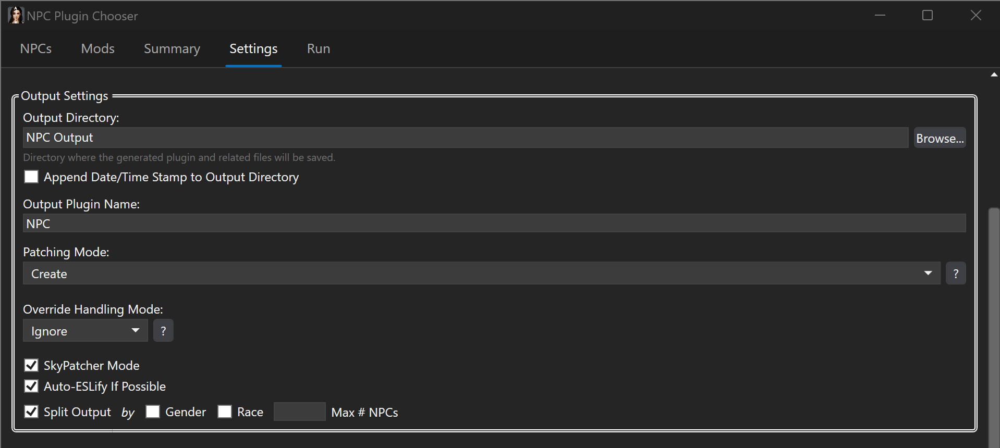

Here you control the files that N.P.C.2 generates.

* **Output Directory**: Where the generated plugin and assets go. A simple name (e.g. `NPC Output`) creates that folder inside your Mods Folder; a full path sends output wherever you specify (use this if your Mods Folder isn’t your mod manager’s folder).
* **Append Date/Time Stamp to Output Directory**: Adds a timestamp to the output folder name so you never overwrite a previous run.
* **Output Plugin Name**: The name of the generated plugin (e.g. `NPC` → `NPC.esp`).
* **Patching Mode**: The core behavior of the patcher (click the **?** for in-app help):
    * *Create and Patch*: Behaves like EasyNPC. Your conflict-winning NPC records are patched to use your selected appearance mods. No further action required.
    * *Create*: Splices your selections into a standalone appearance mod without considering your load order — treat it like any other appearance mod you’d download (put its plugin high in the load order, its assets low, and resolve conflicts yourself or with Synthesis FaceFixer).
* **Override Handling Mode**: How the patcher treats appearance mods that *modify* preexisting **non-NPC** records. To be clear about what this means: most appearance mods ship their own brand-new (“de novo”) support records — skins, head parts, tints, and the like — and those are always carried over normally. What’s rare, and what this setting actually controls, is when a mod **overrides** a record that *already exists* (a base-game Race, Outfit, etc.) rather than adding its own. This is a default that can be overridden per-mod in the Mods tab. Options are *Ignore*, *Include*, and *Include As New* (explained under [Mods Menu](#record-override-handling) and in the FAQ). **Leave this on *Ignore* here** — override handling is slow and 99% of mods don’t need it; turn it on only for the specific mods that do.
* **SkyPatcher Mode**: If checked, N.P.C.2 writes a SkyPatcher `.ini` instead of editing NPC records directly. Handy if you prefer SkyPatcher, but be aware it can conflict with other runtime appearance patchers like RSV or SynthEBD.
* **Auto-ESLify If Possible**: Flags the output plugin as ESL (light) when it qualifies, so it doesn’t consume a full load-order slot.
* **Split Output**: Splits your output into multiple plugins instead of one. You can split *by Gender*, *by Race*, and/or by a *Max # NPCs* per plugin. This is useful for dodging “Too Many Masters” errors without switching to SkyPatcher mode.

### Display Settings

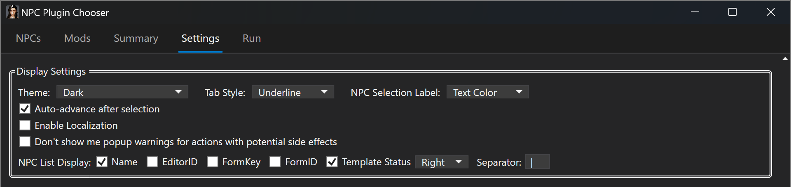

Cosmetic and convenience options for the app itself.

* **Theme** / **Tab Style**: Control the color theme and how the top tabs are styled.
* **NPC Selection Label**: Adds a colored indicator to **every** NPC in the list that has a saved appearance selection, so you can see your progress at a glance. The color encodes the selection’s status — **green** = the chosen mod’s data is available, **purple** = you only have a mugshot (mod not installed), **red** = the NPC isn’t in your load order. Choose how the indicator is drawn: **Bar** (a colored stripe), **Text Color** (tints the NPC’s name), or **None**.
* **Auto-advance after selection**: When checked, choosing an appearance automatically moves you to the next NPC — great for blasting through a long list.
* **Enable Localization**: Shows **NPC names** in a language you pick, instead of the default (usually English). This affects *only* the NPC names in the list — the app’s own interface (buttons, menus, labels) stays in English. See the note below for how it behaves.
* **Don’t show me popup warnings for actions with potential side effects**: Suppresses the confirmation popups for bulk/destructive actions if you find them annoying.
* **NPC List Display**: Choose which identifiers appear next to each NPC in the left-hand list — **Name**, **EditorID**, **FormKey**, **FormID**, and/or **Template Status** — along with where they’re shown and which **Separator** character divides them.

#### A note on NPC name localization

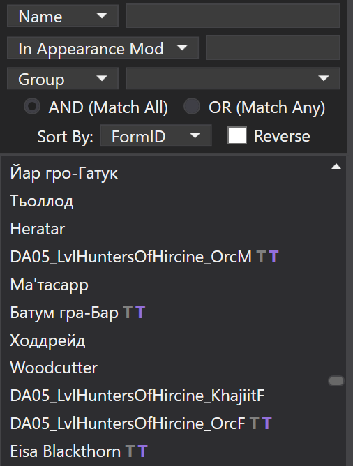

When localization is on, N.P.C.2 asks each NPC’s plugin for that NPC’s name *in your chosen language*. Skyrim stores names in two ways: as plain embedded text, or as **localized strings** kept in separate per-language files (the `.STRINGS` files that ship with translated games and mods). For each NPC, N.P.C.2 uses the translated name **if that plugin actually provides one in your language**; if it doesn’t, it falls back to the default (English) text.

That’s why you’ll usually see a **mix of languages** in the list, as in the Russian example above. Vanilla and properly-translated NPCs show up in your language (e.g. `Йар гро-Гатук`, `Ходдрейд`), while names from English-only appearance mods — or records that simply have no translation for that language — fall back to English (e.g. `Heratar`, `Woodcutter`). Entries shown by their EditorID rather than a real name (e.g. `DA05_LvlHuntersOfHircine_OrcM`, typically generic/unnamed leveled NPCs) are never translated, since an EditorID isn’t a localized string. In short: what you get depends on which translations actually exist in your installed plugins — N.P.C.2 just surfaces whatever is (or isn’t) there.

### Mugshot Settings

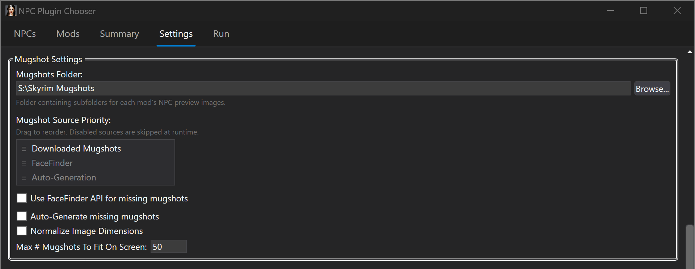

“Mugshots” are the face preview images you click on in the NPCs tab. N.P.C.2 can draw them from up to three sources, and this section controls all of them.

* **Mugshots Folder**: The folder containing one subfolder of preview images per mod (the same layout EasyNPC uses).
* **Mugshot Source Priority**: A drag-to-reorder list of the three sources — **Downloaded Mugshots**, **FaceFinder**, and **Auto-Generation**. When more than one source has an image for the same mod/NPC, the one higher in this list wins. Disabled sources are skipped.
* **Use FaceFinder API for missing mugshots** / **Auto-Generate missing mugshots**: Enable the two generated sources (detailed below).
* **Normalize Image Dimensions**: Shows every mugshot at the same size and aspect ratio (cropping to center if needed). Uncheck it to show images at their raw resolution.
* **Max # Mugshots To Fit On Screen**: When you select an NPC, N.P.C.2 shrinks the mugshots until up to this many fit on screen. Higher = more on screen but smaller and slower to load. You can always zoom afterward.

#### FaceFinder (online mugshots)

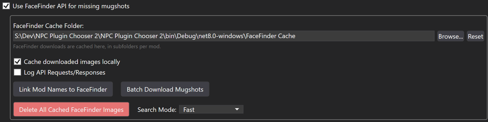

If you check **Use FaceFinder API for missing mugshots**, N.P.C.2 can download face previews from the online FaceFinder service for mods you don’t have local mugshots for.

* **FaceFinder Cache Folder**: Where downloaded images are cached (one subfolder per mod). **Cache downloaded images locally** keeps them so they don’t have to be re-fetched.
* **Log API Requests/Responses**: Diagnostic logging for troubleshooting connection issues.
* **Link Mod Names to FaceFinder**: Opens the linking window (below) so you can match your locally-installed mods to FaceFinder’s database when the names don’t line up.
* **Batch Download Mugshots**: Pre-fetches FaceFinder mugshots for your whole mod list in one pass, so you’re not waiting on downloads later.
* **Delete All Cached FaceFinder Images**: Clears the FaceFinder cache.
* **Search Mode**: Sitting next to **Delete All Cached**, this dropdown only affects how that deletion takes stock of what’s on disk before clearing it — it has no effect on downloading. *Fast* trusts N.P.C.2’s cached list of downloaded images (recommended); *Comprehensive* re-scans every mugshot folder and reads each image’s metadata (slower, but catches files the cache doesn’t know about).

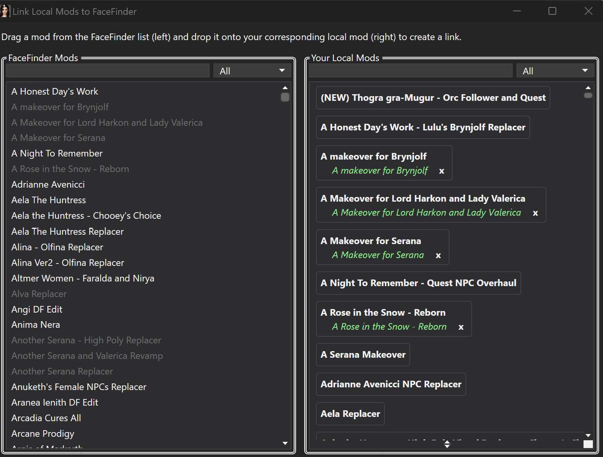

In the **Link Local Mods to FaceFinder** window, drag a mod from the FaceFinder list on the left onto the matching local mod on the right to create a link. Mods that are already linked show a green sub-label with an **x** to unlink them. Both lists have search boxes to help you find a specific mod.

#### Auto-Generation (built-in 3D renderer)

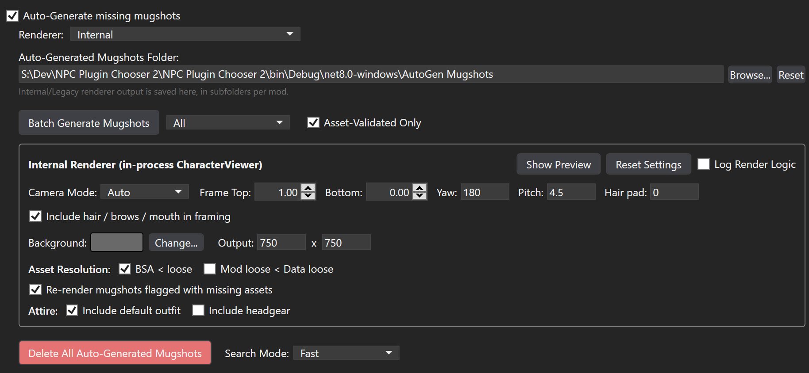

If you check **Auto-Generate missing mugshots**, N.P.C.2 will render its own mugshots using a built-in 3D renderer, directly from the mod’s mesh/texture data — so you can preview any appearance mod even if nobody has published mugshots for it.

* **Renderer**: Which engine produces the renders — **Internal** or **Legacy** (more on this below).
* **Auto-Generated Mugshots Folder**: Where the output images are saved (one subfolder per mod). **Reset** restores the default folder.
* **Batch Generate Mugshots**: Render mugshots in bulk for **All** mods (or a subset). **Asset-Validated Only** skips NPCs whose required assets are missing.
* **Camera / framing controls** (Camera Mode, Frame Top/Bottom, Yaw, Pitch, Hair pad, “Include hair / brows / mouth in framing”): Aim and frame the shot.
* **Background** / **Output** size: The background color and the pixel dimensions of the generated images.
* **Asset Resolution**: Controls which copy of an asset wins when the same file exists in more than one place (e.g. a BSA vs. a loose file).
* **Attire**: Whether the rendered character wears their **default outfit** and/or **headgear**.
* **Re-render When**: Which staleness checks trigger an automatic re-render of an existing mugshot — when it was produced by a **Newer renderer version**, when the **Stale Conditions** it was generated with (lighting, camera / framing, background, resolution, render options) no longer match your current settings, or when it was flagged with **Missing Assets** (meshes / textures that couldn’t be found). All three are on by default; turn one off to keep those mugshots in place instead of regenerating them.
* **Delete All Auto-Generated Mugshots**: Clears everything the renderer has produced. The adjacent **Search Mode** dropdown only changes how this deletion inventories existing renders first — *Fast* uses N.P.C.2’s cached list (recommended), *Comprehensive* re-scans all folders and reads metadata.

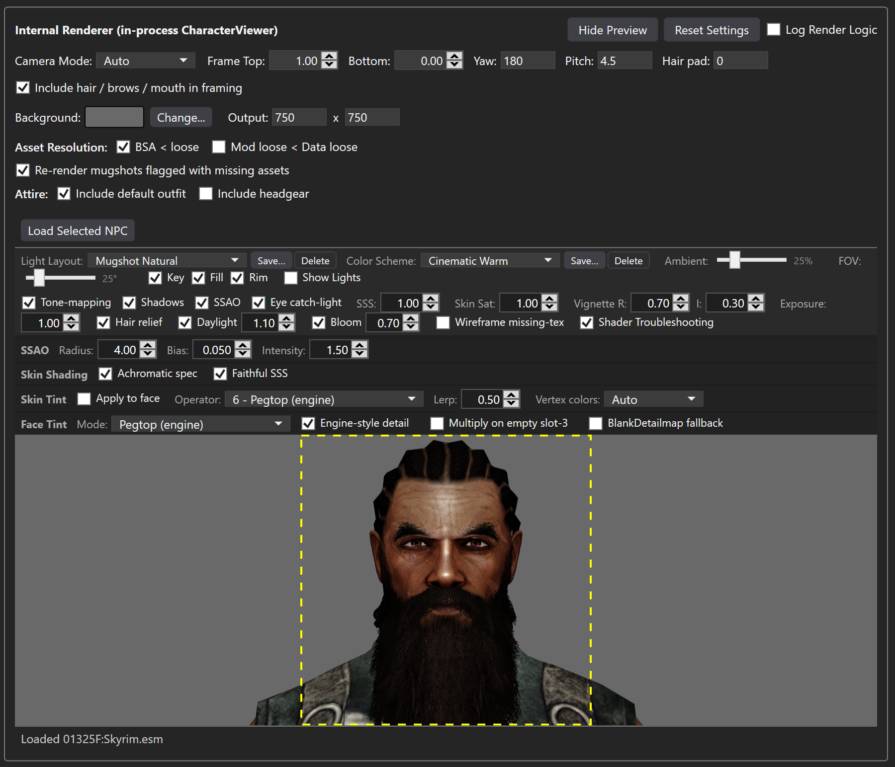

Click **Show Preview** to open a live preview of the renderer using the NPC you currently have selected. The yellow dashed rectangle shows the crop that will be applied to the final mugshot. Tune the controls until it looks right, then batch-generate.

**Load Selected NPC** loads whichever NPC is currently selected over in the **NPCs** tab into the preview, using the appearance mod you’ve chosen for that NPC. (So pick an NPC and give it an appearance there first, then come here to preview and tune it.)

The remaining controls along the top adjust how the render *looks*. None of them touch the underlying mod — they only shape the generated image:

* **Light Layout** — a preset arrangement of the scene’s lights (where each one sits and how bright it is). Pick a built-in preset, or save your own with **Save…**.
* **Color Scheme** — the color/warmth of the lights (e.g. warm vs. cool). Mixes freely with any layout.
* **Ambient** — the level of soft, even light filling the whole scene. Raise it to brighten the shadows, lower it for a moodier look.
* **FOV** — the camera “lens.” Lower values flatten the face for a flattering portrait look; higher values widen it toward a more in-game feel.
* **Key / Fill / Rim** — toggles for the three main lights: the **Key** (the primary light), the **Fill** (softens the shadows the key leaves behind), and the **Rim** (a back/edge light that separates the head from the background).
* **Show Lights** — draws a 3D arrow in the viewport for each light. **Click an arrow to open that light’s own editor**, where you can aim it and set its brightness and color (hue) individually.
* **Tone-mapping** — film-style color finishing that makes the result read like a photograph instead of a flat render. Several of the controls below only take effect when this is on.
* **Shadows** — lets facial features cast soft shadows (brow over the eyes, nose onto the cheek, hair onto the forehead).
* **SSAO** — subtle darkening in nooks and creases (eye sockets, nostrils, the lip line) that adds a sense of depth.
* **Eye catch-light** — adds the small bright glint in the eyes that makes them look alive.
* **SSS** — how much light appears to pass *through* and glow within the skin. Higher gives a warmer, fleshier, more lifelike look; 0 turns it off.
* **Skin Sat** — color intensity (saturation) of the skin only.
* **Vignette R / I** — a gentle darkening toward the edges of the frame. **R** sets how large the clear center stays; **I** sets how dark the corners get.
* **Exposure** — overall image brightness (1.0 is neutral).
* **Hair relief** — keeps hair from being crushed too dark by the tone-mapping, so brown/blonde hair holds onto its midtones.
* **Daylight** — brightens and slightly warms the lights toward a sunny, outdoor look (helps blonde hair match its in-game daylight appearance). The number beside it sets how strong the boost is.
* **Bloom** — a soft glow that bright highlights (like blonde hair) bleed into. The number beside it sets how strong the glow is.
* **Wireframe missing-tex** — when a shape’s texture fails to load, draws it as a green wireframe so the problem is obvious rather than silently hidden.
* **Shader Troubleshooting** — an experimental area for testing the renderer’s shader code. The defaults are fine for everyone; you can safely leave this alone.

#### Internal vs. Legacy renderer

The **Renderer** dropdown chooses which engine generates the mugshots. **Internal** is the modern, in-process renderer (with all the live preview and lighting controls described above) and is what you should use. **Legacy** is the older NPC Portrait Creator renderer, kept only for users who are attached to its particular visual style — it is **no longer being developed**. It lives in its own repository ([NPC-Portrait-Creator](https://github.com/Piranha91/NPC-Portrait-Creator)), and N.P.C.2 ships with a compiled copy bundled in.

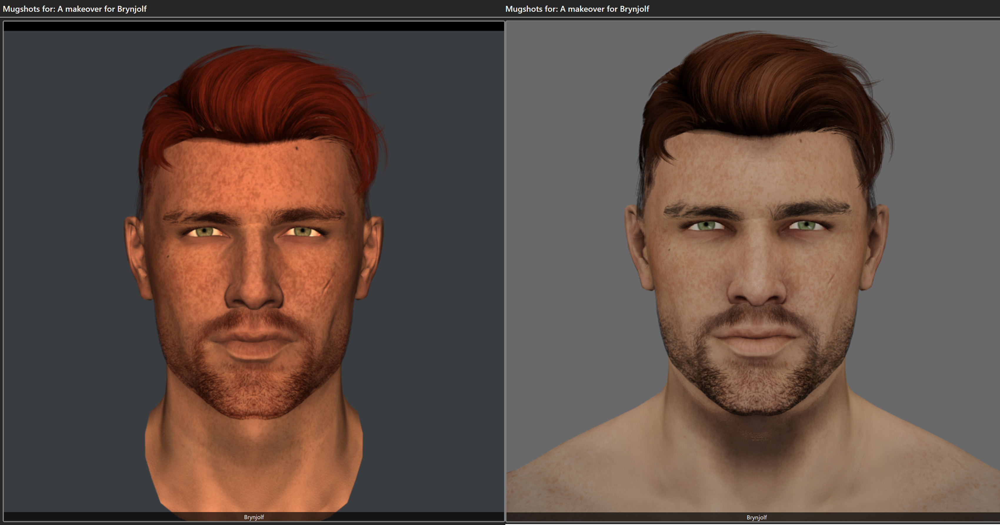

*Legacy renderer (left) vs. Internal renderer (right) for the same mod.*

#### Which outfit does the preview wear?

When the **Attire** toggle has the character wearing their default outfit, N.P.C.2 doesn't just show the outfit from the appearance mod's plugin — it predicts the outfit the NPC will *actually wear in game* after your patching-mode choice **and** any runtime outfit distributors (SkyPatcher configs, SPID `_DISTR.ini` files) have had their say. Mugshots and the [3D preview](#3d-preview) both follow these rules, and a mugshot only re-renders when the *resolved outfit itself* changes — flipping settings that land on the same outfit costs nothing.

Legend for the tables below:

* **Mod's outfit** — the outfit from the selected appearance mod's plugin (what **Include Outfit** would carry into the output).
* **Winning outfit** — the outfit on the conflict-winning override of the NPC in your load order (what EasyNPC-style patching preserves).
* **SkyPatcher outfit** — the outfit set by the *last* matching `outfitDefault=` line across your installed SkyPatcher npc configs (that's the one SkyPatcher itself applies).
* **SPID outfit** — the outfit from the *first* matching `Outfit =` entry across your `*_DISTR.ini` files (that's the one SPID itself applies). Entries with a chance below 100 are random at runtime and are never depicted.

An external entry only "matches" if its filters match the NPC **and** its outfit actually resolves in your load order; otherwise it's skipped and the next row down supplies the outfit.

**Normal mode (SkyPatcher Mode off):**

| Patching mode | Include Outfit | SkyPatcher ini matches | SPID entry matches | Preview displays | Warning shown |
|---|---|---|---|---|---|
| Create | ✘ | ✘ | ✘ | Mod's outfit | — |
| Create | ✘ | ✘ | ✔ | SPID outfit | — |
| Create | ✘ | ✔ | any | SkyPatcher outfit | — |
| Create | ✔ | ✘ | ✘ | Mod's outfit | — |
| Create | ✔ | ✘ | ✔ | SPID outfit | ⚠ Include Outfit overridden by SPID |
| Create | ✔ | ✔ | any | SkyPatcher outfit | ⚠ Include Outfit overridden by SkyPatcher |
| Create and Patch | ✘ | ✘ | ✘ | Winning outfit | — |
| Create and Patch | ✘ | ✘ | ✔ | SPID outfit | — |
| Create and Patch | ✘ | ✔ | any | SkyPatcher outfit | — |
| Create and Patch | ✔ | ✘ | ✘ | Mod's outfit | — |
| Create and Patch | ✔ | ✘ | ✔ | SPID outfit | ⚠ Include Outfit overridden by SPID |
| Create and Patch | ✔ | ✔ | any | SkyPatcher outfit | ⚠ Include Outfit overridden by SkyPatcher |

Note the Create-mode quirk: Create forwards the appearance mod's whole NPC record, so the mod's outfit ships even with **Include Outfit** off — the checkbox only changes whether a runtime override *warns* you.

**SkyPatcher Mode (either patching mode — neither touches the NPC record at plugin level):**

With **Include Outfit** on, N.P.C.2's own SkyPatcher ini sets the outfit, so it competes with any external SkyPatcher configs by ordinary SkyPatcher config order — whichever loads later wins. (Configs directly in `SkyPatcher\npc\` load before any subfolder; subfolders load in name order, so only a subfolder sorting after `NPC Plugin Chooser` beats N.P.C.2's entry.)

| Include Outfit | SkyPatcher ini matches | SPID entry matches | Preview displays | Warning shown |
|---|---|---|---|---|
| ✘ | ✘ | ✘ | Winning outfit | — |
| ✘ | ✘ | ✔ | SPID outfit | — |
| ✘ | ✔ | any | SkyPatcher outfit | — |
| ✔ | ✘ | ✘ | Mod's outfit (via N.P.C.2's ini) | — |
| ✔ | ✘ | ✔ | Mod's outfit — N.P.C.2's directive suspends SPID | — |
| ✔ | ✔, loads *before* N.P.C.2's ini | any | Mod's outfit | — |
| ✔ | ✔, loads *after* N.P.C.2's ini | any | SkyPatcher outfit | ⚠ N.P.C.2's SkyPatcher entry not conflict-winning |

**Why SkyPatcher beats SPID:** SPID deliberately backs off an NPC whose default outfit no longer matches the value it read from the plugins — and SkyPatcher's edits (including N.P.C.2's own, in SkyPatcher Mode) are exactly such a change. Two edge cases bend the tables:

* If SkyPatcher assigns the **same** outfit the record already has (including N.P.C.2's directive being a no-op because the mod's outfit equals the winning one), SPID does *not* suspend — a matching SPID entry wins after all, and with **Include Outfit** on you'll get the SPID-overridden warning.
* A runtime winner that happens to equal the mod's outfit displays without a warning — what you asked for is what's shown.

When a warning applies, the mugshot tile shows an orange **⚠** badge (hover it for which config wins and why) and the 3D preview shows a banner; when a distributor changes the outfit *without* defeating an Include Outfit request, the preview's status line simply notes where the outfit came from. Rare filter types that only exist at runtime (skill-based filters, sub-100% chances) are treated conservatively and called out as approximations in the tooltip.

### FaceGen Analysis

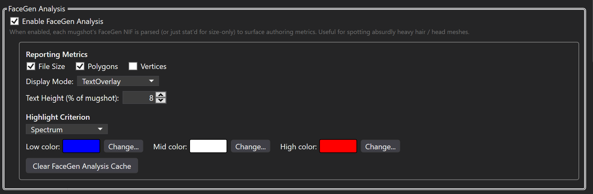

An optional diagnostic that reports how *heavy* each appearance’s FaceGen mesh is, so you can spot mods whose head/hair geometry is absurdly high-poly — a common cause of performance problems. It’s off by default.

* **Enable FaceGen Analysis** — turns it on. N.P.C.2 then inspects each mugshot’s FaceGen mesh (or just checks its file size, if that’s all you asked for) and shows the results in the NPCs gallery. The numbers are cached, so the cost is paid only once per appearance.
* **Reporting Metrics** — which stats to show: **File Size**, **Polygons** (the triangle / “face” count), and/or **Vertices**.
* **Display Mode** — **TextOverlay** prints the numbers right on each mugshot; **Tooltip** shows a small indicator instead and reveals the full stats on hover.
* **Text Height (% of mugshot)** — how large the overlaid text is, relative to the tile.
* **Highlight Criterion** — how the numbers are colored so heavy meshes jump out. **Spectrum** (shown) fades each value across a configurable **Low → Mid → High** color gradient, so the heaviest meshes glow red; other modes instead flag the heaviest few percent of tiles, or anything past a set threshold.
* **Clear FaceGen Analysis Cache** — discards the stored measurements so they’re recalculated the next time you view them.

### EasyNPC Transfer

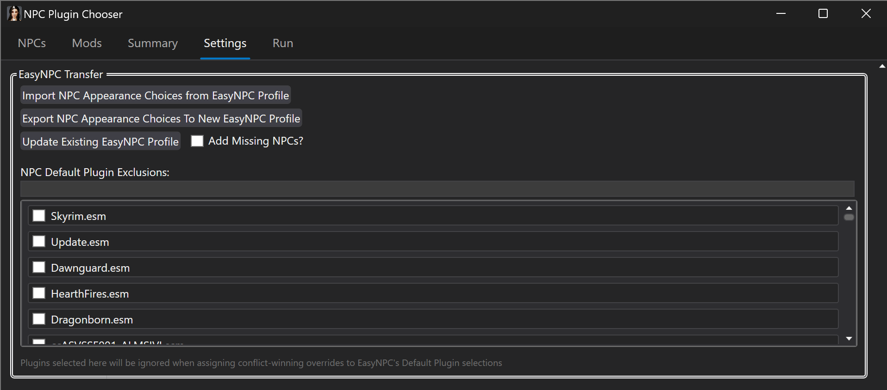

Tools for moving appearance choices between N.P.C.2 and EasyNPC. (EasyNPC selects *plugins*, while N.P.C.2 selects *mods*, so the conversion does some matching.)

* **Import NPC Appearance Choices from EasyNPC Profile**: Loads selections from an exported EasyNPC profile, matching its plugin choices to your available mods.
* **Export NPC Appearance Choices To New EasyNPC Profile**: Converts your mod selections into a fresh EasyNPC profile. Default Plugins are chosen from your conflict-winning records. (FaceGen-only mods can’t be exported because they have no plugin.)
* **Update Existing EasyNPC Profile**: Like the export, but keeps the Default Plugins from the file you select and only changes the appearance plugin. **Add Missing NPCs?** adds any NPCs you’ve chosen that weren’t already in that profile.
* **NPC Default Plugin Exclusions**: Plugins checked here are never chosen as EasyNPC “Default Plugins” during export — useful if you don’t want Synthesis/zEdit outputs serving as defaults.

### Load Order Import Settings

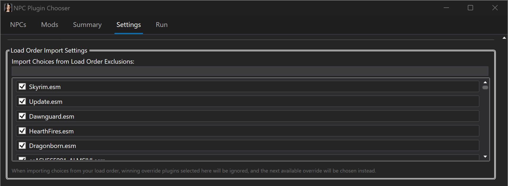

* **Import Choices from Load Order Exclusions**: When you use **Get from Load Order** in the NPCs tab to auto-derive your appearance choices, any plugins checked here are skipped as winning overrides — N.P.C.2 picks the next override down the conflict chain instead. (By default the base masters are checked so they aren’t treated as appearance mods.)

### Mod Import Settings

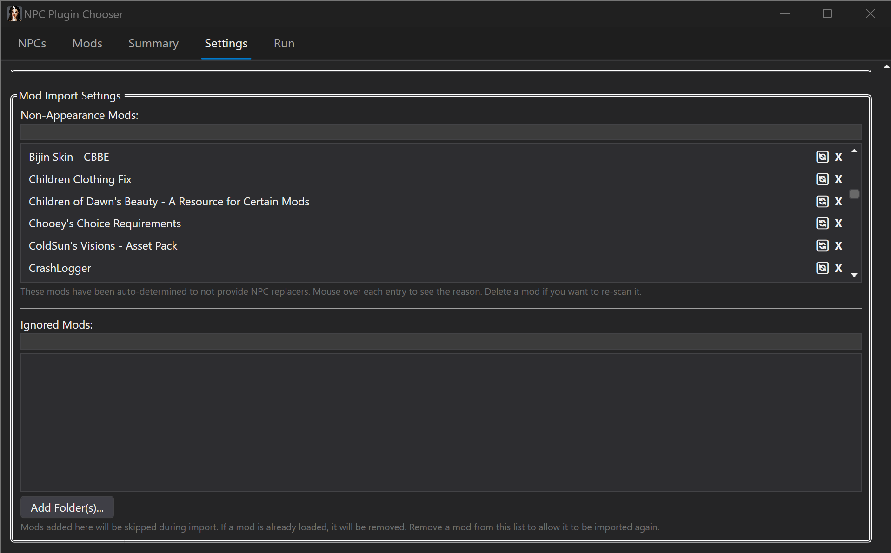

Two lists that control N.P.C.2’s analysis of your mod folder.

* **Non-Appearance Mods**: Mods that N.P.C.2 decided don’t add or change any NPC appearances. Mouse over an entry to see *why* it was excluded. If N.P.C.2 got it wrong (or a mod updated and now does provide NPCs), click the entry’s re-scan icon or the **X** to remove it so it gets re-analyzed on the next launch.
* **Ignored Mods**: A list you control of mod folders to skip entirely during import. Use **Add Folder(s)...** to add them; remove a mod from the list to allow it back in.

### Spawn Bat File Options

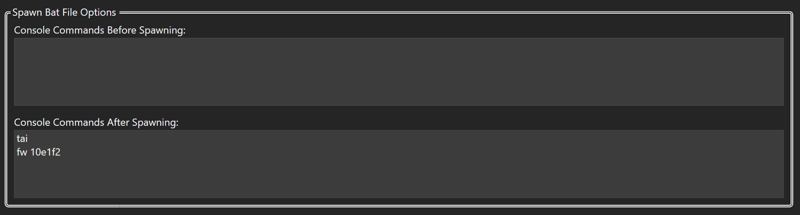

Options for the in-game spawn `.bat` files N.P.C.2 can generate from the Run tab.

* **Console Commands Before Spawning**: Commands inserted before the `player.placeatme` lines.
* **Console Commands After Spawning**: Commands inserted after them. (The author likes to add `tai` here so the spawned NPCs hold still long enough to inspect.)

### Logging

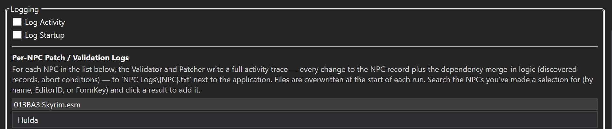

Diagnostic logging for troubleshooting.

* **Log Activity**: Writes a general activity trace to **`EventLog.txt`** in the application folder (the folder that holds the .exe).
* **Log Startup**: Writes a phased startup trace — environment resolution and the full mod-loading pipeline — to **`StartupLog.txt`** in the application folder. (You can also turn this on without opening Settings by dropping an empty file named **`LogStartup.txt`** next to the .exe.)
* **Per-NPC Patch / Validation Logs**: For any NPC you add here, the Validator and Patcher write a complete per-NPC trace (every change to the record plus the dependency merge-in logic) to `NPC Logs\{NPC}.txt` next to the app. Search by name, EditorID, or FormKey (the screenshot shows a FormKey typed in) and click a result to add it. This is the best tool for figuring out why a specific NPC didn’t come out right.

## NPCs Menu

This is where you actually choose each NPC’s appearance. The left panel lists your NPCs; the main area shows a gallery of mugshots — one per appearance mod that provides the selected NPC.

The toolbar across the top is grouped into sections, covered below.

### NPC Groups

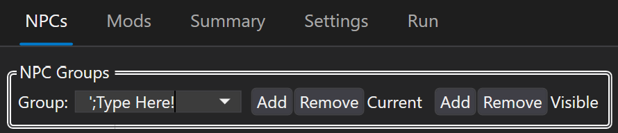

Groups let you operate on a subset of NPCs (e.g. when patching or making spawn `.bat` files). Type a name into the box to make a new group, or pick an existing one from the dropdown, then:

* **Add / Remove Current**: Adds or removes the currently selected NPC.
* **Add / Remove Visible**: Adds or removes every NPC currently visible in the left panel under your active filters.

### Show

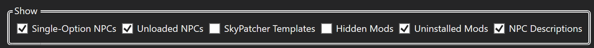

Visibility toggles for the NPC list:

* **Single-Option NPCs**: NPCs that only have one appearance source (nothing to choose between). Hide them to focus on the meaningful decisions.
* **Unloaded NPCs**: NPCs not in your current load order (e.g. ones you only have a mugshot pack for, or that live in your separate appearance-mods folder). Useful when you want to copy their appearance onto an NPC that *is* loaded.
* **SkyPatcher Templates**: Shows NPCs that exist as SkyPatcher template targets.
* **Hidden Mods**: Reveals mugshots you’ve hidden via the right-click menu (so you can un-hide them).
* **Uninstalled Mods**: Shows mugshots for mods you don’t currently have installed (selectable as placeholders).
* **NPC Descriptions**: Toggles the short lore description shown at the bottom for the selected NPC (sourced from UESP / the Elder Scrolls Wiki — requires an internet connection). For non-vanilla NPCs you can supply your own descriptions via `.json` files in the `DescriptionOverrides` folder (see `ExampleOverride.json`).

### NPC Appearance Selections

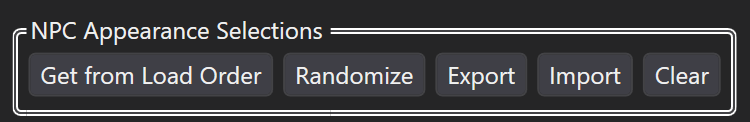

Bulk actions on your whole set of choices:

* **Get from Load Order**: Scans your load order to figure out which mods you’re currently using as appearance mods, and selects them automatically (respecting the Load Order Import exclusions in Settings).
* **Randomize**: Opens the [Randomize window](#randomizing-appearances) to assign random appearances.
* **Export** / **Import**: Back up your selections to a `.json` file and restore them later. (This file is N.P.C.2-specific — it is *not* cross-compatible with EasyNPC; use the Settings tab for that.)
* **Clear**: Removes all selections so you can start fresh.

### Selected Mugshots

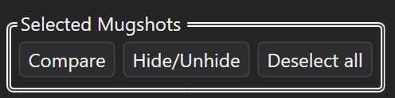

These act on the mugshots you’ve check-marked (using the checkbox in each tile’s top-right corner):

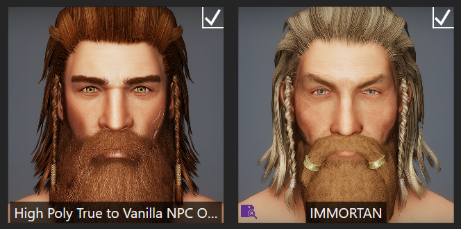

* **Compare**: Opens the check-marked mugshots side-by-side in full screen so you can judge them head-to-head, ignoring the ones you don’t care about.

* **Hide/Unhide**: Hides the check-marked mugshots (or restores them if you’re viewing hidden mods). Hidden mugshots stay out of your way until you want them back.
* **Deselect all**: Clears all the check marks.

### Submenus

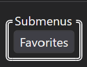

Currently this group holds a single button, **Favorites**, which opens the [Favorite Faces window](#favorite-faces).

### Searching & Filtering

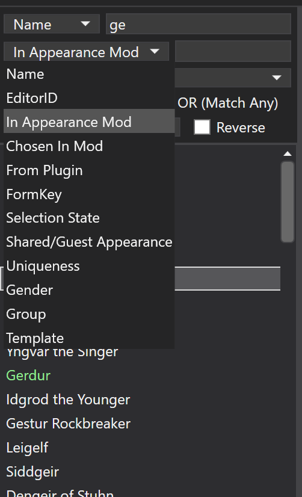

The filter rows above the NPC list let you narrow down which NPCs are shown. Each row has a dropdown picking *what* to match on, plus a value box. You can combine two rows with **AND (Match All)** or **OR (Match Any)**, and **Sort By** / **Reverse** to order the list. The match fields include:

* **Name** / **EditorID** / **FormKey** / **FormID** — identifiers for the NPC.
* **In Appearance Mod** — NPCs provided by a given mod.
* **Chosen In Mod** — NPCs for which you’ve selected a given mod.
* **From Plugin** — the plugin the NPC is defined in.
* **Selection State** — whether or not you’ve made a choice.
* **Shared/Guest Appearance** — NPCs using a shared appearance.
* **Uniqueness** / **Gender** / **Group** / **Template** — other categorizations.

### The NPC List

The left panel is your list of NPCs. Hover an entry to see its full details (name, EditorID, FormKey, FormID, and group membership):

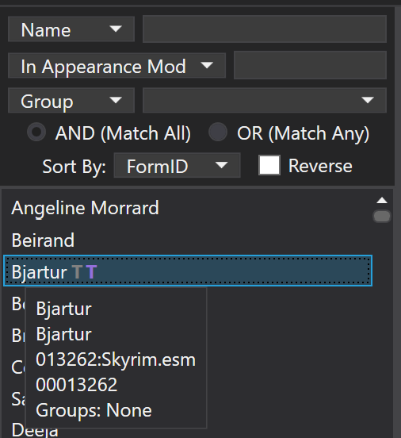

Some NPCs show small purple **T** badges, which indicate template relationships (one NPC borrowing another’s appearance via the game’s “template” mechanic). Hovering each badge explains the relationship — whether this NPC is the winning template source for another NPC, or is referenced as a template source by one:

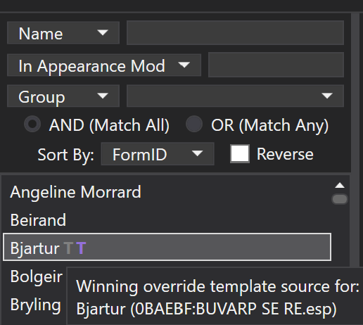

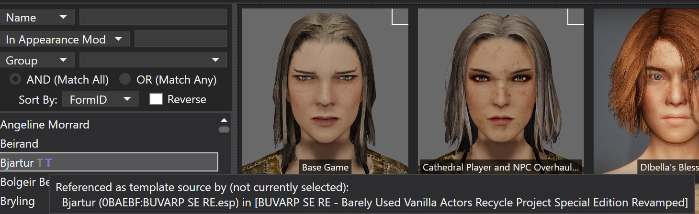

**Right-clicking an NPC** in the list opens a context menu with per-NPC options:

* **Include Outfits** — whether the chosen appearance mod’s outfit is applied to this NPC: use the mod’s own setting, always include, or never include.

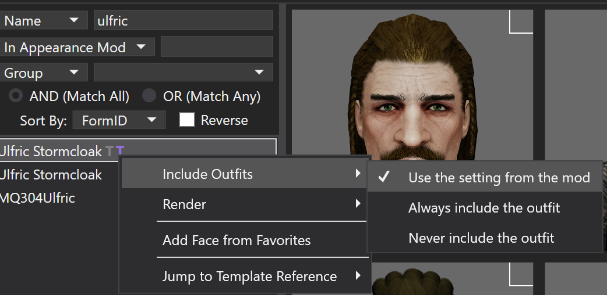

* **Render** — per-NPC overrides for how this NPC’s auto-generated mugshot/3D render is composed. By default it simply reflects your global render settings (from the Settings tab). To make *this one NPC* different, first check **Override Global Setting** — until you do, the **Include Default Outfit** and **Include Headgear** options stay greyed out. Once it’s checked, toggle those two on or off to control whether this NPC is rendered in its outfit and/or headgear.

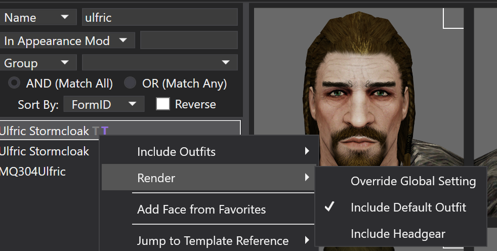

* **Add Face from Favorites** — apply a face from your Favorites library.
* **Jump to Template Reference** — jump to an NPC involved in this NPC’s template relationships.

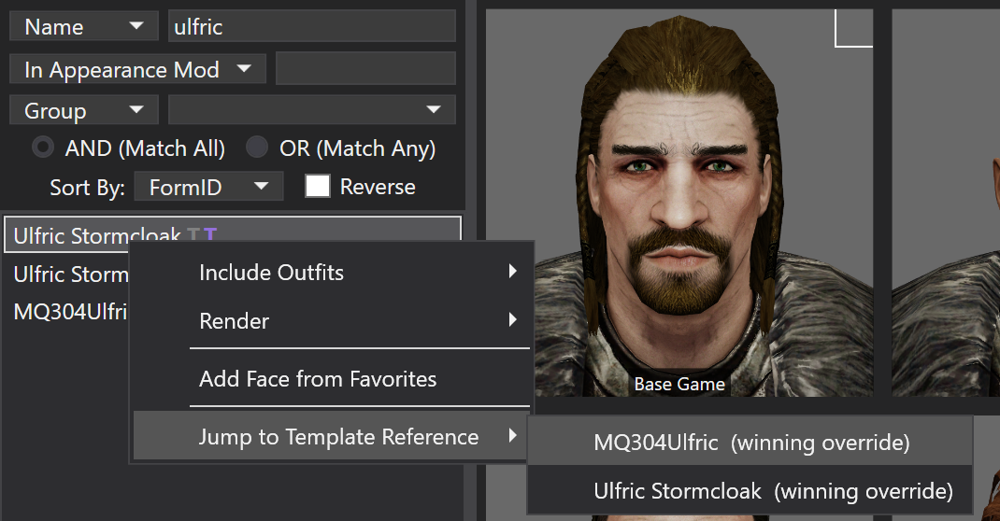

### Making a Selection

To choose an appearance, click its mugshot (or placeholder). The tile gets a colored border indicating the result:

* **Green border** — the mod is installed and the selection is valid.

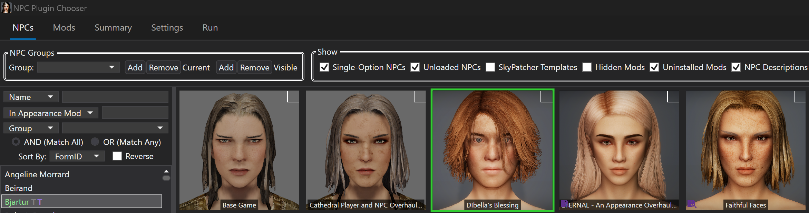

* **Purple border** — you’ve selected a mugshot whose mod isn’t actually installed. You can still make the selection, but that NPC will be skipped at patch time until you install the corresponding mod.

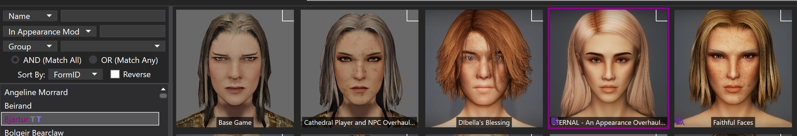

If a mod provides an appearance but you have no mugshot for it, you’ll see a generic helmet **placeholder** instead — it works exactly like a real mugshot for selection purposes:

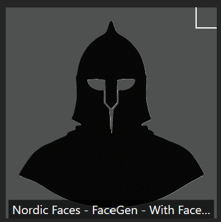

### Choosing Which Mugshot Source To Show

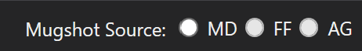

At the bottom of the gallery, the **Mugshot Source** toggle lets you override, for the NPC you’re looking at, which source the gallery draws from: **MD** = Manually Downloaded (curated) mugshots, **FF** = FaceFinder, **AG** = Auto-Generated. With none selected, N.P.C.2 uses your default priority order from Settings — which can show a mix of curated and generated images:

Selecting **AG** forces the gallery to show the app’s own renders wherever it has the mod data to produce them — handy for an apples-to-apples comparison under identical lighting:

### Mugshot Right-Click Menu

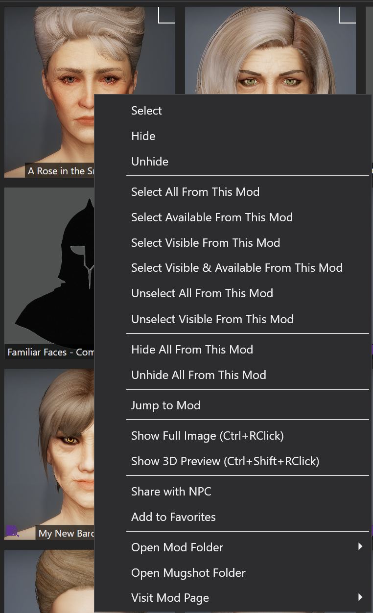

Right-clicking a mugshot opens a rich context menu:

* **Select / Hide / Unhide** — same as clicking the tile, or the Hide/Unhide button.
* **Select All / Available / Visible From This Mod** (and the matching **Unselect** entries) — apply (or remove) this mod across many NPCs at once: all NPCs it provides, only those you haven’t chosen yet (“Available”), only those currently visible under your filters, etc. This is the “choose this mod for everything it provides” power feature.
* **Hide All / Unhide All From This Mod** — bulk hide or reveal every mugshot from this mod.
* **Jump to Mod** — switch to the Mods tab focused on this mod.
* **Show Full Image (Ctrl+RClick)** — full-screen view of the mugshot.
* **Show 3D Preview (Ctrl+Shift+RClick)** — opens the interactive [3D preview](#3d-preview).
* **Share with NPC** — make this appearance available to a *different* NPC (see below).
* **Add to Favorites** — save this face to your [Favorites](#favorite-faces) library.
* **Open Mod Folder / Open Mugshot Folder / Visit Mod Page** — quick links to the files on disk or the mod’s web page.

### Sharing an Appearance Between NPCs

One of N.P.C.2’s signature features: you can take any NPC’s appearance and use it on another NPC. Right-click the mugshot whose look you want and choose **Share with NPC**:

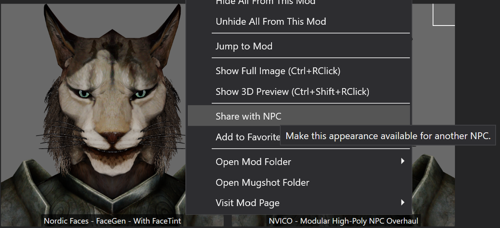

In the window that appears, search for the NPC you want to give that appearance to. **Share and Select** applies the appearance immediately; **Share** just makes it *available* in that NPC’s gallery without selecting it yet (so you can compare it against other options first):

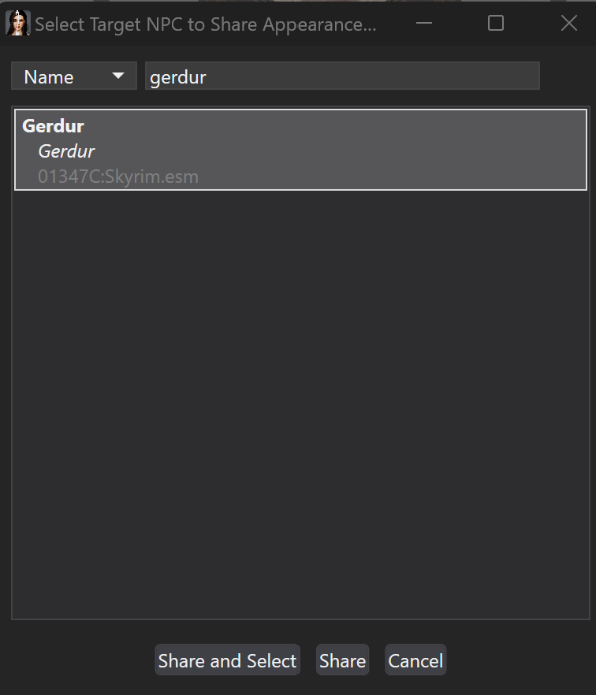

Afterward, the shared mugshot appears in the target NPC’s gallery, and hovering it explains whose appearance it is:

### Mugshot Symbols

Mugshots can carry small icons in their corners that flag special states. Hover any of them for details.

* **Helmet placeholder** — no mugshot image exists for this mod/NPC (covered above).

* **Purple floppy-disk icon** — you have the mugshot but not the mod. You can select it as a placeholder, but the NPC won’t be included in the output until the real mod is installed.

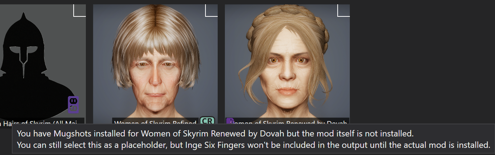

* **Purple wall-plug icon** — this mod provides the NPC through more than one plugin. Right-click and use **Select Source Plugin** to pick which one supplies this NPC’s record.

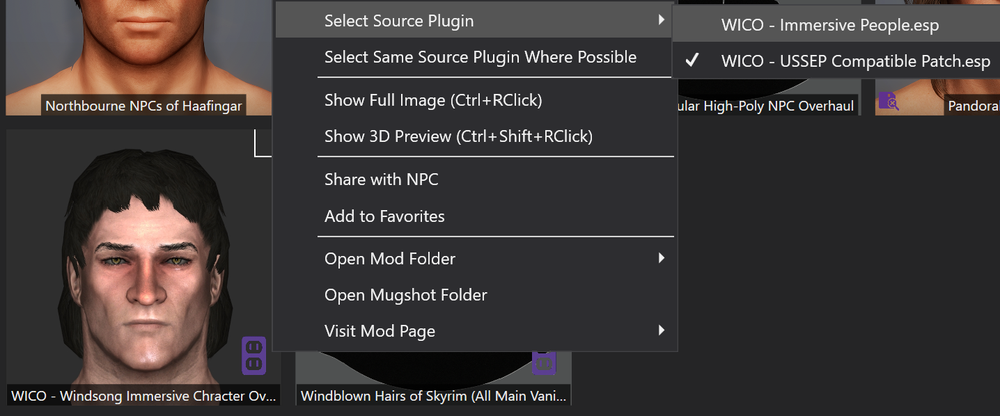

* **Red missing-assets icon** — appears only on **auto-generated** mugshots. When N.P.C.2 rendered this appearance itself, some required asset files (textures/meshes) couldn’t be found; the tooltip lists the exact missing paths. Curated/downloaded mugshots never show it, since they’re pre-made images N.P.C.2 doesn’t render.

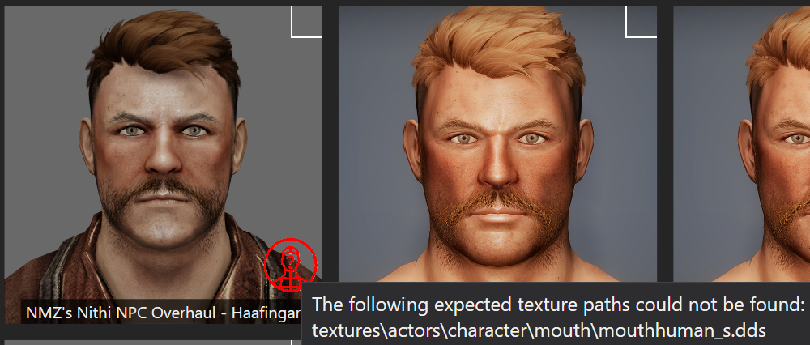

* **Orange ⚠ outfit-conflict badge** — the outfit you asked N.P.C.2 to include for this NPC will be overridden at runtime by a SkyPatcher or SPID config in your load order (or, in SkyPatcher Mode, N.P.C.2’s own outfit entry loses to a later-loading config). The tooltip names the winning config file and line. See [Which outfit does the preview wear?](#which-outfit-does-the-preview-wear) for the full resolution rules.

* **Share badge** — marks an appearance involved in [sharing](#sharing-an-appearance-between-npcs). The same silhouette appears in two colors, one for each direction. One color means the appearance was **shared *to* this NPC** from another — selecting it applies that look, and the tooltip names the donor. The other color means this mugshot’s appearance has been **shared *out* to another NPC** — hovering names the recipient.

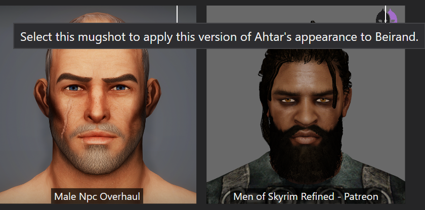

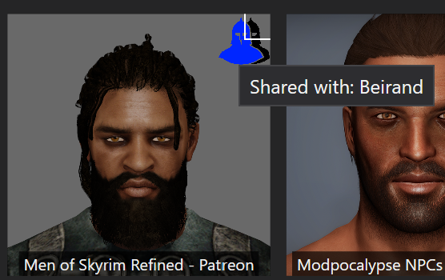

Sharing also works for NPCs handled via SkyPatcher templates — the tooltip spells out which appearance is being applied to whom:

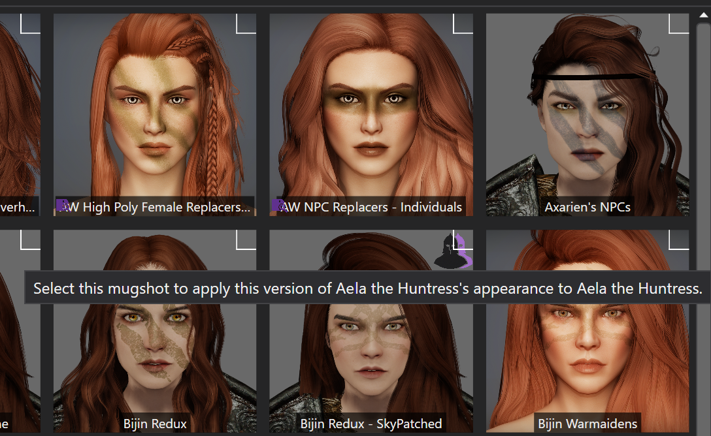

* **Teal “CR” badge** — this one is *not* an N.P.C.2 indicator. It’s baked into the image itself by the FaceFinder service and marks a face that was built with Charmers of the Reach (CotR). It has no effect on anything in N.P.C.2 and can be safely ignored.

### FaceGen Stats Overlay

If you turn on [FaceGen Analysis](#facegen-analysis) in Settings, each mugshot is labeled with its FaceGen geometry stats — here the polygon (**Faces**) count and file **Size** — color-graded so the heaviest head/hair meshes stand out (in the default spectrum, light meshes read blue and heavy ones red). It’s an easy way to catch an appearance whose mesh is wildly more expensive than its neighbors before you commit to it.

### Drag-and-Drop Actions

Two gallery actions work by dragging mugshots around:

**Drag a mugshot and a placeholder together** — links the mugshot to the placeholder’s mod, so that mod shows the image everywhere it appears (not just the current NPC). Use it when a downloaded mugshot pack’s folder name doesn’t match your mod’s name, so N.P.C.2 didn’t link them on its own. The action is valid whenever one tile is a **mugshot with no game data** (a curated *or* FaceFinder image whose mod you don’t have installed) and the other is a **tile backed by game data but with no curated/FaceFinder mugshot of its own** — either a blank helmet placeholder *or* a tile currently showing an auto-generated render. **It doesn’t matter which you drag onto which.**

**Drag a mugshot onto another mugshot** — for every NPC where the *drop-target* mod is currently selected, swaps the selection to the *dropped* mod (wherever it provides that NPC) — i.e. the dropped mod “gives the old one the boot.”

### NPC Description

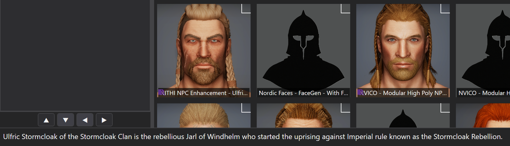

When **Show NPC Descriptions** is on, a short bio of the selected NPC appears at the bottom of the screen — helpful for deciding what an NPC *should* look like when you don’t remember who they are.

### 3D Preview

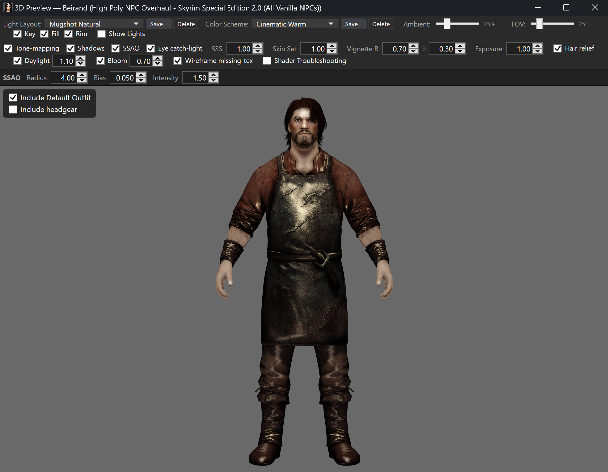

The **Show 3D Preview** option (or Ctrl+Shift+RClick on a mugshot) opens an interactive 3D render of the NPC as that appearance mod would make them. You can spin the model and tune lighting, camera FOV, color grading, and skin shading — the same controls described under [Auto-Generation](#auto-generation-built-in-3d-renderer) — and toggle whether they’re shown in their default outfit and/or headgear, to inspect the appearance far more closely than a static mugshot allows.

With the outfit toggle on, the preview dresses the NPC in the outfit they’ll *actually wear in game* given your patching mode, the Include Outfit setting, and any SkyPatcher/SPID outfit distribution in your load order — see [Which outfit does the preview wear?](#which-outfit-does-the-preview-wear). If a runtime config defeats an outfit you asked N.P.C.2 to include, a warning banner in the preview names the config responsible; otherwise the status line at the bottom notes where a distributed outfit came from.

### Favorite Faces

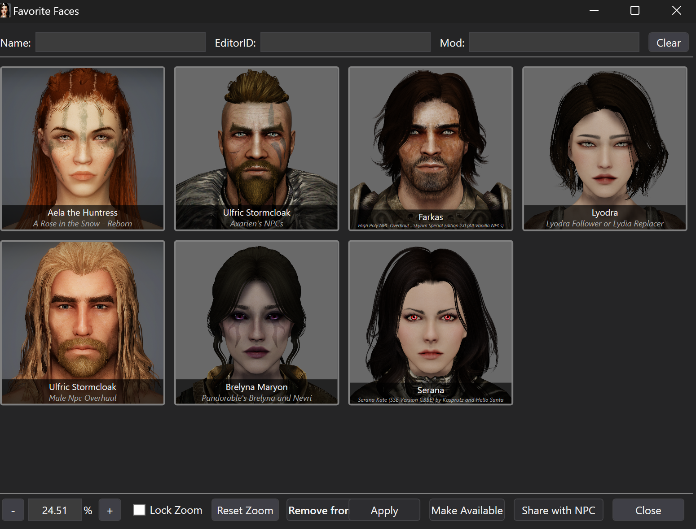

The **Favorites** button (under Submenus) opens your library of bookmarked faces. Any mugshot you **Add to Favorites** lands here, labeled with the NPC and the source mod. From this window you can filter by name/EditorID/mod and then **Apply** a favorite to the current NPC, **Make Available** (add it as a selectable option without selecting it), **Share with NPC**, or **Remove** it from the library. The typical use case: an NPC has several mods offering appearances you like, but you can only pick one of them. Save the runners-up to Favorites, then later share those “also loved but didn’t pick” faces onto other NPCs you think they’d suit.

### Randomizing Appearances

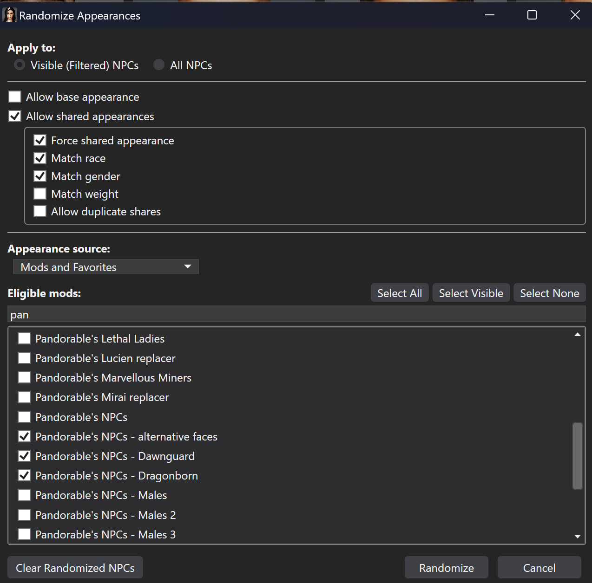

The **Randomize** button bulk-assigns random appearances. You can scope it to the visible (filtered) NPCs or all NPCs, control whether base and shared appearances are allowed (and how shares are matched — by race, gender, weight), pick the appearance source (mods, favorites, or both), and tick exactly which mods are eligible to draw from. **Randomize** applies the assignment; **Clear Randomized NPCs** reverts it.

### Zoom Controls

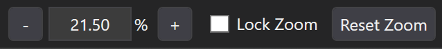

When you select an NPC, N.P.C.2 fits as many mugshots on screen as it can (up to the **Max # Mugshots To Fit** setting). From there you can zoom in/out. **Lock Zoom** keeps the current zoom level for every NPC you visit; **Reset Zoom** returns to fit-on-screen.

## Mods Menu

The Mods tab lists every selectable appearance “mod” with batch settings, and lets you browse all the NPCs each mod contains.

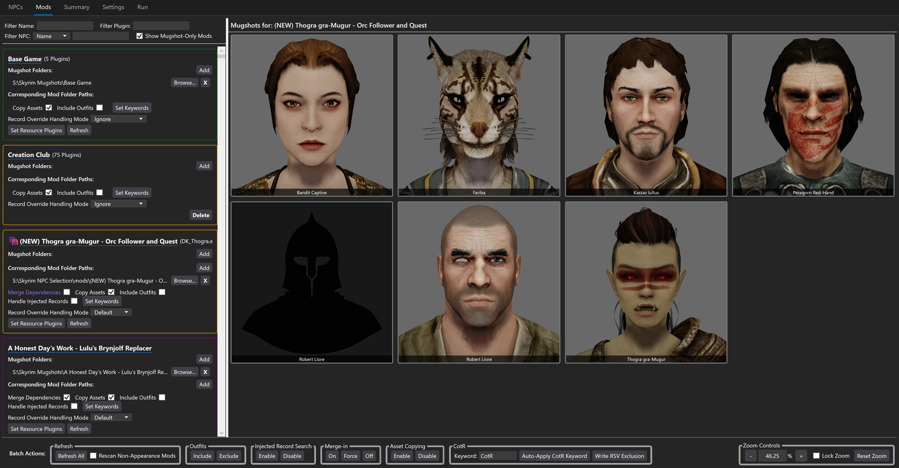

### Color Coding

The colored left-border of each mod entry indicates its status:

* **Green** — mod data is available and mugshots are linked. Ready to use.
* **Purple** — mugshots exist but the mod data isn’t available (selectable as a placeholder; the patcher will skip NPCs you select it for until you install it). This matches the purple selection border in the NPCs menu, which likewise means "you have a mugshot, but the mod isn’t installed."
* **Orange** — data is available but you don’t have mugshots for it (still fully usable for patching; you just won’t see a face preview, unless you turn on [mugshot auto-generation](#auto-generation-built-in-3d-renderer)).
* **Grey** — no data and no mugshots. A red **Delete** button appears so you can remove the orphaned entry.

The two synthetic entries **Base Game** and **Creation Club** appear here too. They represent vanilla and Creation Club content, have a reduced set of controls, and are always treated as having their data available.

Click a mod’s **name** to load its NPCs’ mugshots in the right panel (this can take a moment for large mods; a **Cancel Mugshot Load** button appears while it works).

### Filtering

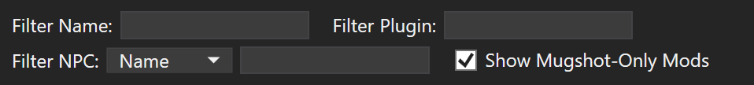

* **Filter Name** / **Filter Plugin** — narrow the list by mod display name or plugin filename.
* **Filter NPC** — show only mods that provide a particular NPC.
* **Show Mugshot-Only Mods** — include mods that supply only mugshots (no resource folders).

### Per-Mod Settings

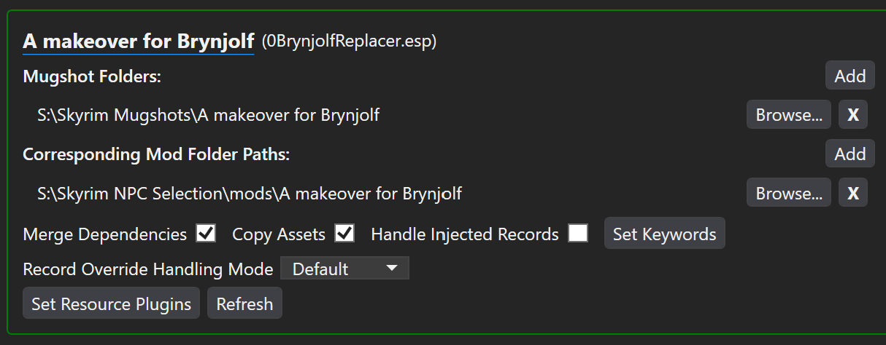

Each mod entry exposes:

* **Mugshot Folders** — folder(s) of preview images for this mod. (You can also set this by drag-and-drop, below.)
* **Corresponding Mod Folder Paths** — the folder(s) where this mod’s actual resources (plugins, meshes, textures) live. By default this is just the mod’s own folder. **Add** more folders when a separate mod is needed as a resource and you want it merged in rather than left as a master (e.g. High Poly Head, Better Argonian Horns). Use **Browse...** to change a path and **X** to remove one.
* **Merge Dependencies** — whether records referenced by the NPC are merged into the output plugin. Leave it **unchecked** for a mod that merely *defines* an NPC you want to forward (e.g. forwarding an NPC’s original look from Legacy of the Dragonborn) — otherwise the patcher tries to merge a huge chunk of that mod and may crash. Pure appearance replacers are fine to merge.
* **Copy Assets** — whether this mod’s non-plugin resources (textures, meshes, and the like *other than* FaceGen) are forwarded into the output folder. If you uncheck it, **you** become responsible for keeping that mod’s assets enabled in your mod manager so the files are still available in-game (the mod’s plugin doesn’t necessarily have to stay enabled — just its assets).
* **Include Outfits** — whether this mod’s NPC outfits are carried into the output (can also be set per-NPC from the NPCs tab). Note that a SkyPatcher or SPID config in your load order can still override an included outfit at runtime — the character previews simulate this and flag it with an orange ⚠ badge when it happens (see [Which outfit does the preview wear?](#which-outfit-does-the-preview-wear)).
* **Handle Injected Records** — also merge in this mod’s *injected* records. An injected record is one a mod slots into another plugin’s FormID space (for example, into Skyrim.esm’s) instead of its own. Normally the patcher only merges records owned by the appearance mod’s own plugins; checking this makes it hunt down injected records as well. Most appearance mods don’t need it and it makes patching slower, so leave it off unless a specific mod requires it.
* **Set Keywords** and **Set Resource Plugins** — open their own dialogs, described just below.
* **Record Override Handling Mode** — how this mod’s *non-NPC* override records are handled (see [Record Override Handling](#record-override-handling)).
* **Refresh** — re-analyze this mod (e.g. after changing its folders).

> **Most users never need to touch Merge Dependencies or Handle Injected Records** — N.P.C.2 sets them for you during the automatic mod import. If it decides a mod is a **base mod** (one with more non-appearance records than appearance ones, like the base game or Legacy of the Dragonborn), it **unchecks Merge Dependencies**; if it finds **injected records**, it **checks Handle Injected Records**. Whenever the analyzer has changed one of these from its default, that control’s label is highlighted in **purple** to flag it. Only adjust them by hand if the automatic classifier got it wrong — usually signalled by unexpected extra master files showing up in your output plugin.

#### Set Resource Plugins

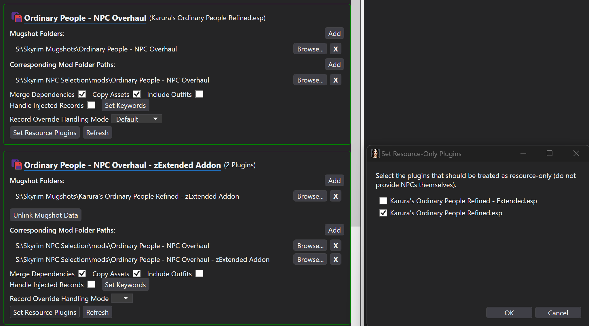

Marking a plugin as **resource-only** tells N.P.C.2: “this plugin supplies supporting records, but don’t treat its NPCs as belonging to this mod.” It matters whenever a mod’s folders pull in a plugin whose NPCs are already owned by a *different* mod entry.

The screenshot shows the exact case it’s built for. *Ordinary People - NPC Overhaul* has its own mod entry, which owns the NPCs that mod provides. Its *zExtended Addon* is installed as a separate mod, but it can’t stand on its own — it relies on the base *Ordinary People* plugin to supply head-part records. So the Addon’s mod entry lists **both** plugins as Corresponding Plugins. Left as-is, that would make the Addon entry re-advertise every NPC from base Ordinary People on top of the handful the Addon actually adds. Marking the base *Ordinary People* plugin as resource-only resolves this: it stays available as a dependency, but only the NPCs from the Addon plugin are counted as this mod’s own.

Like **Merge Dependencies** and **Handle Injected Records**, N.P.C.2’s import analyzer normally detects and marks resource-only plugins for you, so you’ll rarely need this dialog. If you suspect a plugin was marked incorrectly — most likely after upgrading settings from a version older than 2.1.9, when the auto-detection was less reliable — click **Refresh** to re-analyze the mod. If it still gets it wrong, open this dialog and set the resource-only plugins by hand.

#### Set Keywords

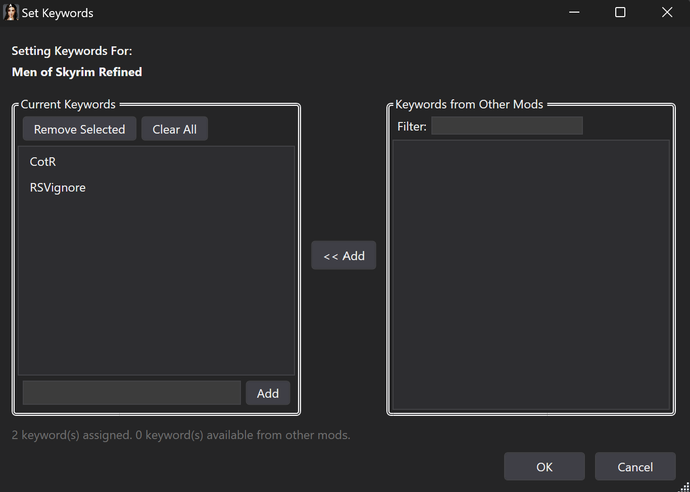

**Set Keywords** lets you attach keywords to the NPCs this mod provides. Use the left pane to add/remove the mod’s current keywords (type one and click **Add**, or remove existing ones), and the right pane to pull in keywords already used by your other mods. These keywords are written onto the NPC records in the output — handy for tagging NPCs so other tools or runtime frameworks treat them a certain way (for example an “ignore”-style keyword that tells another appearance patcher to skip them).

### Resource Folder Detection

N.P.C.2 auto-detects most of a mod’s resource folders by reading its plugins: when a mod’s plugin lists plugins from *other* mods as masters, N.P.C.2 automatically pulls those mods in as **Corresponding Mod Folder Paths**. Often that catches everything the mod needs:

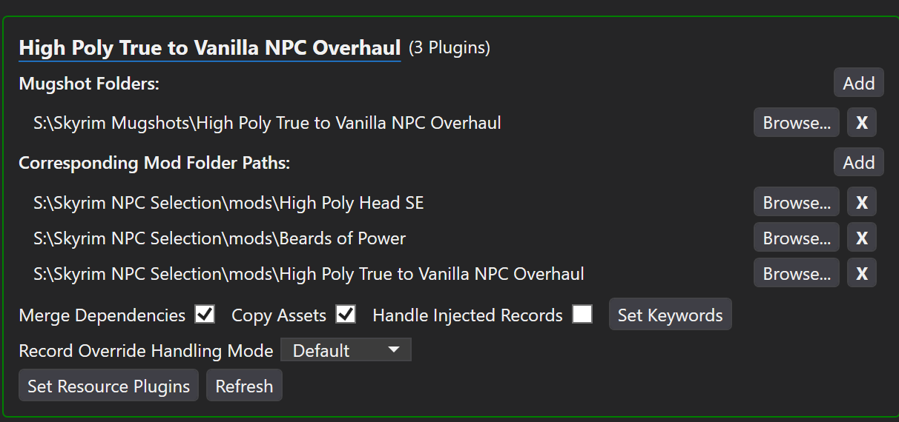

But this master-based detection can’t catch a **plugin-independent** dependency — one a mod relies on purely for loose assets, with no plugin master reference to give it away. For example, *Modpocalypse NPCs (v4)* needs *Modpocalypse - Resources (v4)* only for its loose meshes and textures; because nothing in the plugin points to it, N.P.C.2 has no way to know it’s required, so you have to add it yourself. When such a “silent” dependency is missing, the affected NPCs render with **missing assets** (note the red icons and the bald heads, where the head/hair meshes couldn’t be found). A whole batch of auto-generated mugshots flagged with missing assets is a strong sign you’re missing a dependency like this:

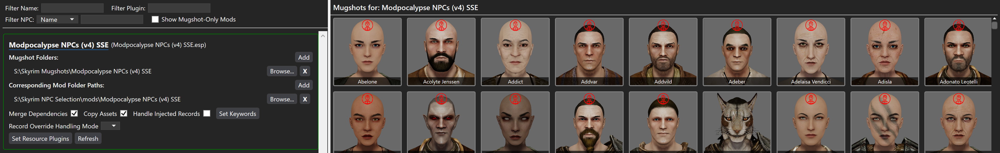

Add the missing folder under **Corresponding Mod Folder Paths**, and the assets resolve — the mugshots render correctly:

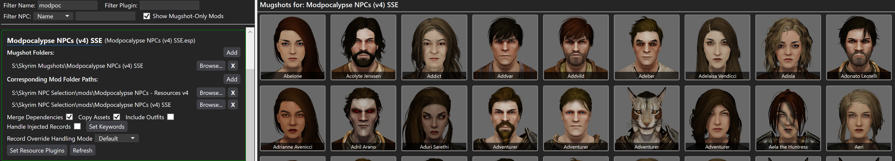

### Record Override Handling

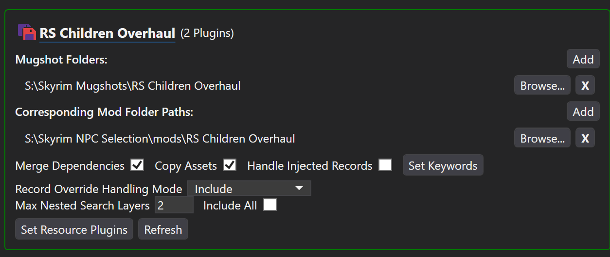

A small number of appearance mods (e.g. RS Children Overhaul) also modify *non-NPC* records — like Races — and don’t work right without those changes. The **Record Override Handling Mode** dropdown controls this per-mod:

* **Ignore** — don’t carry the overrides (the default, and correct for almost every mod). If an NPC’s appearance actually relies on one of these overridden records, ignoring it can leave that NPC looking wrong in-game — for example a dark face bug — which is your cue to switch this mod to *Include*.
* **Include** — incorporate the changes (delta-patched into your winning records in *Create and Patch* mode, or copied directly in *Create* mode). Selecting **Include** reveals extra controls — **Max Nested Search Layers** (how deep to follow record references) and **Include All**.
* **Include As New** — copy the modified record as a brand-new record and point the NPC at it, avoiding conflicts with other mods that touch the original.

Override handling is slow and can crash the patcher on big base mods, so **only enable it for the specific mods that visibly need it** (an NPC looks bugged in-game). See the FAQ for a deeper explanation of the trade-offs.

## Summary Menu

The Summary tab is an at-a-glance overview of every NPC you’ve made a selection for, each shown as a mugshot labeled with the chosen source mod. Use **View Mode** to switch between **Gallery** (pictured) and **List**, filter by **NPC Group**, set the page size, and page through your choices. It’s the quickest way to sanity-check your whole setup before running the patcher.

## Run Menu

This is where you generate output and verify it.

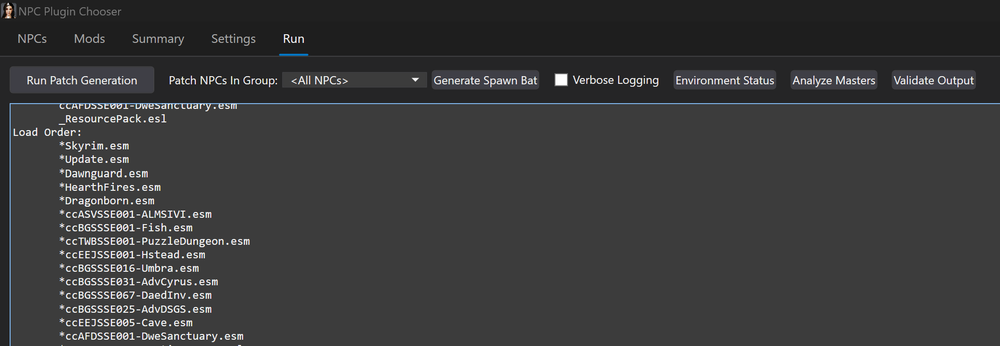

* **Run Patch Generation**: Applies your selections and writes the output plugin + assets to your output folder.
* **Patch NPCs In Group**: Choose whether to patch (or make `.bat` files for) **\<All NPCs\>** or one of the groups you defined in the NPCs tab.
* **Generate Spawn Bat**: Writes a `.bat` file that spawns the NPCs in the selected group, so you can line them up in-game and check that they look right.
* **Verbose Logging**: Produces a detailed log — recommended only for troubleshooting.
* **Environment Status**: Prints your current configuration and full load order into the output pane (pictured). If you’re asking for help, copy this into a PasteBin and share the link.
* **Analyze Masters** and **Validate Output**: Verification tools, covered below.

### Validation Prompt

When you run patch generation, N.P.C.2 **first** checks that every selected mod is actually installed and provides the NPC you chose it for. Any selections that fail (mod missing, or NPC not in the mod) are listed, and you’re asked whether to abort, or skip those NPCs and continue with the valid selections.

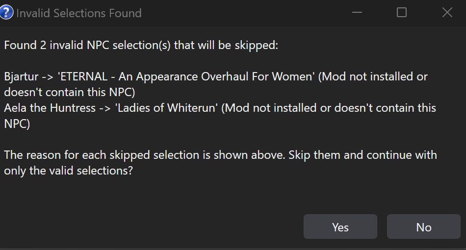

Once you continue, the patcher runs; the output pane reports progress and finishes with a performance summary, the saved plugin path, and asset-copy verification:

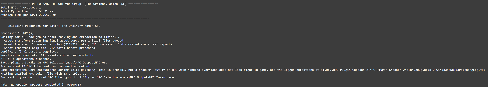

### Validate Output

The **Validate Output** tool inspects an *already-generated* output against your selections to confirm the deployed result really matches what you picked — invaluable when something in your load order might be overwriting N.P.C.2’s output.

> **Important — refresh your mod manager first.** Validation reads the output exactly as your mod manager deploys it, so the freshly-generated files must be present in the mod manager’s virtual file system. After generating output you need to: **(1)** close N.P.C.2; **(2)** in your mod manager, enable the output mod and its plugin(s) (if you didn’t already in a previous session); and **(3)** relaunch N.P.C.2 **through your mod manager**, so it rebuilds the virtual file system with the new output included. If you validate immediately after generating without doing this, the check runs against a stale virtual file system that doesn’t contain your latest output, and the results will be misleading.

First, choose whether to validate every NPC with a selection or a hand-picked subset:

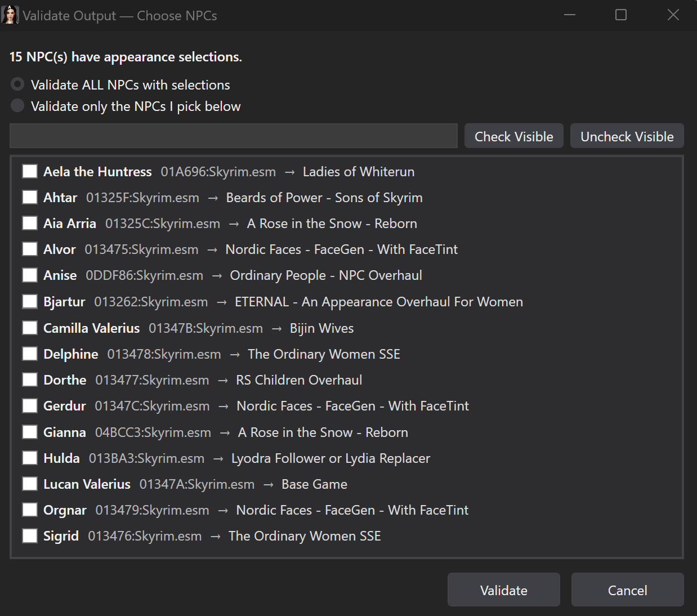

The results flag three classes of problem — **Selection** (the chosen mod is no longer configured), **Record** (the conflict-winning NPC record doesn’t match the selected mod, with a field-level diff), and **Asset** (the deployed FaceGen mesh differs from the selected mod’s) — and name the **Winning Source** that overrode your intended appearance. You can export everything to TSV/CSV:

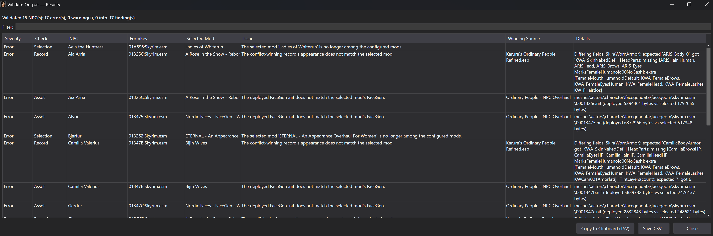

(The example above is a deliberately contrived setup — an “Ordinary People” overhaul placed so it wins conflicts over N.P.C.2’s output — to demonstrate what each finding looks like:)

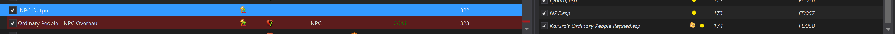

### Analyze Masters

The **Analyze Masters** tool explains *why* your output plugin depends on each of its masters. Pick which masters to analyze:

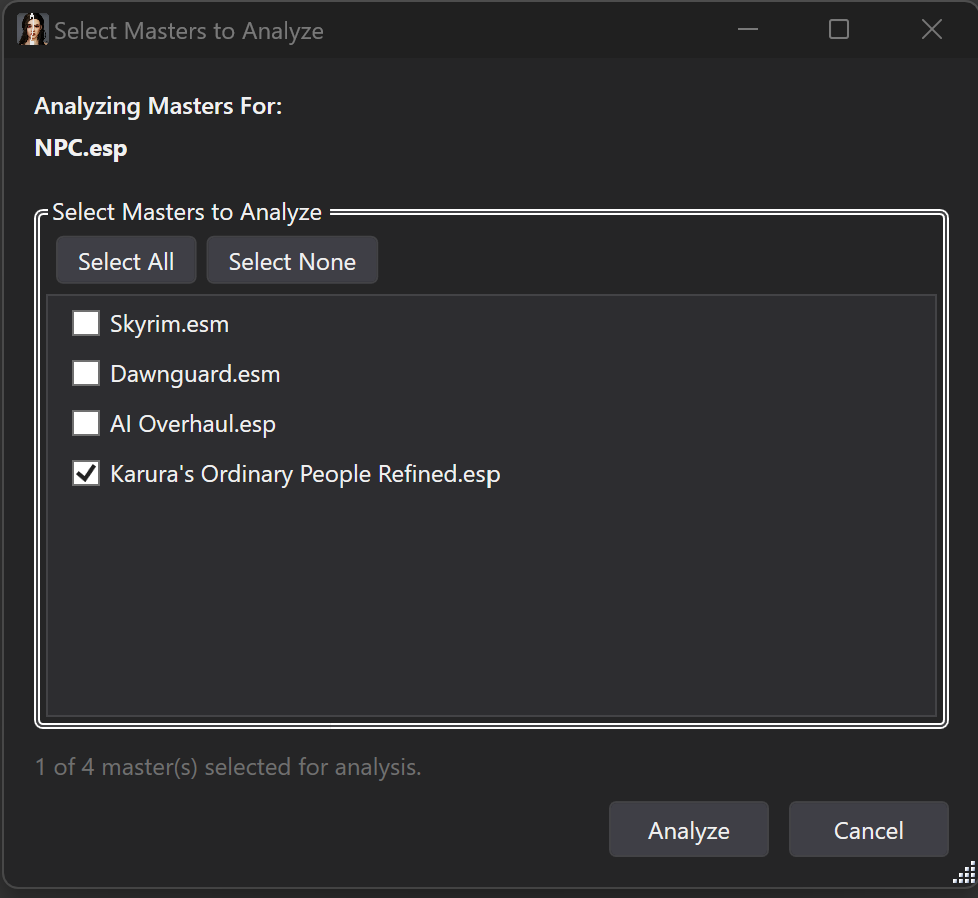

The report lists every record in your output that still references the chosen master, and the exact field doing the referencing — so you can decide whether that master is one you actually want to keep:

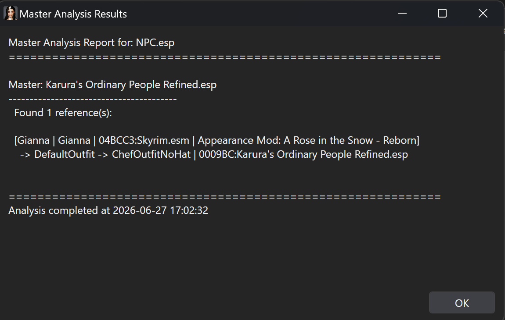

The screenshots use a deliberately contrived example. Here *Karura's Ordinary People.esp* has been left **active** in the load order as the conflict-winning override for Gianna, with the patcher in **Create and Patch** mode. The patcher therefore applies the selected appearance (from *A Rose in the Snow*) on top of Gianna's winning record — which is Karura's. Because Karura's gives Gianna a brand-new Default Outfit record, that outfit is pulled along, and the output ends up inheriting Karura's as a master. Analyze Masters surfaces exactly that dependency, and you can confirm it by hand in xEdit/SSEEdit:

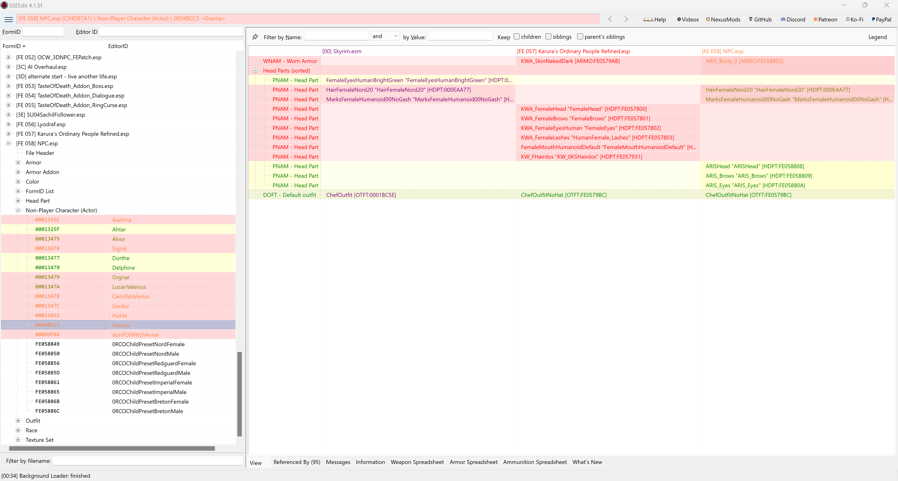

> **Tip:** this is exactly why I usually recommend leaving your appearance overhauls **disabled** in your load order. N.P.C.2 can fish all the data and assets it needs out of disabled mods, so a disabled overhaul won't sneak in as a master dependency the way an active conflict-winning override can.

# FAQ

**Q: Where do I get Mugshots?**

A: I like [Natural Lighting Mugshots](https://www.nexusmods.com/skyrimspecialedition/mods/97595) the best. Other sources include [EasyNPC Mugshot Collection](https://www.nexusmods.com/skyrimspecialedition/mods/99546), [Modpocalypse mugshots](https://www.nexusmods.com/skyrimspecialedition/mods/103837), and the EasyNPC Discord channel. You can also have N.P.C.2 generate mugshots itself — see [Mugshot Settings](#mugshot-settings).

**Q: A mod I want to preview doesn’t have mugshots. What can I do?**

A: Turn on **Auto-Generate missing mugshots** (to render them from the mod’s own data) and/or **Use FaceFinder API for missing mugshots** (to download them) in the Mugshot Settings section. You can tune the renderer’s lighting and framing via **Show Preview**, then batch-generate for your whole list.

**Q: How do I migrate from/to EasyNPC?**

A: Go to the Settings tab and scroll down to the EasyNPC Transfer section, and click either the Import or Export button.

**Q: For EasyNPC Export, what’s the difference between Export to New vs. Update Existing?**

A: Export To New will assign new Default Plugins based on your load order, while Update Existing will keep the ones in the file that you’re updating and only change the appearance plugin.

**Q: What’s the difference between “Create” and “Create & Patch”?**

A: *Create* splices together your selections into a mod, but doesn’t consider your load order - the resulting plugin will look exactly as if you took the NPCs from your selected mods and stitched them together. You then have to do the conflict patching yourself, or use Synthesis FaceFixer to do it automatically. *Create and Patch* does both things for you, and actually patches your load order to use your selected appearance mods (similar to EasyNPC). In both cases, the N.P.C.2 output assets (textures and meshes) should win all conflicts, but in *Create* mode the plugin should go as high as possible in your load order (and then you or FaceFixer patch the conflicts) while in *Create and Patch* the generated file should only be overwritten by other patcher outputs.

**Q: What’s “Record Override Handling Mode” and when should I use it?**

A: A very small number of appearance mods make changes within records that aren’t typically associated with appearance replacers (e.g. modifying Race records), and don’t work correctly without these modifications. If you set the handling mode to “Include” or “Include as New”, N.P.C.2 will forward these changes into the output. Doing so for all NPCs slows down the patcher quite a bit (and in some cases can crash it) so only use this for the plugins that need it. An example of such a plugin is RS Children.

**Q: For the Handling Mode, what’s the difference between “Include” vs. “Include as New”?**

A: When record overrides are detected, the patcher will handle them in one of three ways:

1. If the Handling Mode is Include As New, the override records will be copied into new records, and any references to them from the NPC will be remapped to these new records. This avoids conflicts with other mods that might reference those records, but by the same token you lose the effects of any mods that touched the original record.
2. If Handling Mode is “Include” and Patching Mode is “Create and Patch”, the patcher will compare the override record to its base record, note the changes, and patch them into your conflict-winning version of that record (this is similar in a way to how Mator Smash works). Note that this is an automated and unsupervised process, so you may want to check the output in xEdit and make sure everything was handled correctly.
3. If Handling Mode is “Include” and Patching Mode is “Create”, the overrides will just be copied in directly from the source mods. Conflict resolution with other mods that touch these records will be on you.

The option to choose depends on your needs. If you’re comfortable in xEdit, the safest option is always “Create” because then you just do the conflict resolution yourself, but obviously that’ll get tedious to do whenever you rebuild an NPC merge. “Include” mode is good if you’re comfortable enough in xEdit to take a quick look and make sure the changes forwarded from the appearance mod make sense. “Include as new” may be necessary if you have multiple appearance mod that override the same record in different ways - this will allow you to separate them and use both versions of that record.

As a reminder, this is getting in the weeds and for the vast majority of appearance replacers, you shouldn’t need to override non-appearance records at all.

**Q: How do I check that my output actually came out right?**

A: Use the **Validate Output** button in the Run tab. It compares the deployed result against your selections and flags any NPC whose record or FaceGen mesh doesn’t match what you chose (and tells you which plugin won the conflict). **Analyze Masters** complements it by showing why your output depends on each master.

For an in-game spot check, you can also use **Generate Spawn Bat** (Run tab) to spawn a Group of NPCs in front of you and eyeball them. Make a small Group for this — e.g. one NPC of each race + gender — rather than using `<All NPCs>`: a spawn bat for the entire list tries to summon thousands of NPCs at once and will crash anything short of a supercomputer.

**Q: Why is NPC2 connecting to the internet? Is this spyware?**

A: This is the Description Provider connecting to UESP or The Elder Scrolls Wiki to source the description of the NPC you’re looking at (and, if enabled, FaceFinder fetching mugshots). You can disable the descriptions by unchecking “Show NPC Descriptions”, and FaceFinder is off unless you enable it.

**Q: How do NPC Descriptions work for mod-added NPCs that aren’t in UESP?**

A: By default, N.P.C.2 just won’t show descriptions for those NPCs. If you want to add them, you can go the the DescriptionOverrides folder (found in the same folder as the N.P.C.2 .exe file) and create a .json file containing descriptions for the new NPCs. You can find an example in the ExampleOverride.json file in that directory.

Before writing your own, check whether someone has already done the work — community-made description files are available online, such as [NPC Descriptions for NPC Plugin Chooser 2](https://www.nexusmods.com/skyrimspecialedition/mods/157339). And if you do write descriptions for a mod that isn’t covered yet, please consider sharing them so others can benefit — and try to keep them spoiler-free, since people read these to decide an appearance without necessarily knowing the character yet.

**Q: Can N.P.C.2 handle facegen-only mods like Nordic Faces that don’t come with a plugin?**

A: Yes. It’ll use the base plugin for those NPCs for conflict patching.

**Q: Why can’t I see {some NPC} from {some mod}?**

A: Check the Rejected NPCs subfolder (next to the main .exe file). It contains logs for all discarded NPCs.

**Q: My appearance mod is mastered to another mod. How do I get that mod to also be merged into the output patch rather than the output patch being mastered to it?**

A: Go to the Mods tab, find your mod, and add the master mod to its Corresponding Mod Folder Paths.

**Q: N.P.C.2 is deciding that my mod is not an appearance mod. Why?**

A: Either it is missing a master and thus can’t be analyzed, or it doesn’t add any new NPCs or modify facial features of existing ones. If it’s missing a master, go to the Settings tab, scroll down to the Non-Appearance Mods list, find your mod, and remove it. Then close N.P.C.2, enable the missing master, and relaunch.

**Q: My NPC Groups dropdown box is empty. How do I add a group?**

A: Type your desired group name in the box and click Add Current or Add Visible to get it started with either your currently selected NPC or all NPCs visible in the sidebar with your current filter settings.

**Q: I’m trying to add some mod (say, Children of the Hist) and I’m getting missing masters error for a mod that I don’t have in my load order (example: Better Argonian Horns). What do I do?**

A: Children of the Hist needs Better Argonian Horns as a master. If you for some reason don’t want Better Argonian Horns in your load order, install it, keep it disabled, and add the installation folder as one of the Corresponding Mod Folder Paths for Children of the Hist.

**Q: Can you add X feature?**

A: Feel free to pitch ideas, but know that I’ll be pretty selective about what I implement, and I’m likely to only act on low-hanging fruit. I have limited bandwidth for modding and several projects on the go, so I’ll only take on requests that are fast and easy to implement.

**Q: Why is this tagged as AI generated?**

A: Because I used LLMs (mostly Gemini, and also ChatGPT) to write some of the code.

**Q: So is this all AI Slop? Can I trust it?**

A: I primarily used the AI to make the UI, because that part of the process requires a lot of boilerplate code and isn’t particularly fun. For the part that actually interacts with Skyrim data, I took my code from N.P.C.1 and fed it to Gemini, asking to hook it up to the buttons and new data structure from N.P.C.2. I ended up having to rewrite the vast majority of that code myself, and checked over all of it. If there are any bugs attributable to using an LLM, they’ll be in the UI - any bugs in the Skyrim-facing code are of my own making.

**Q: What are the permissions?**

A: Open permissions to the extent allowed by the tools that were used to make this. If you want to modify it, I’d appreciate a Git PR just to keep things centralized and avoid having multiple branches but if you message me and I don’t response for more than a couple weeks, assume I’ve moved on and feel free to launch your own fork.

**Q: Do you accept donations?**

A: Nope, this is a passion project. If you would otherwise send a donation my way, please consider instead supporting humanitarian organizations in Ukraine such as [United24](https://u24.gov.ua/donate), which is where I would forward the money anyway.

**Acknowledgements**

* Noggog for creating Mutagen and teaching me how to use it
* Focustense for creating EasyNPC and providing inspiration
* Istenno for letting me use his Natural Lighting Mugshots to make the logo
* Gemini and Claude for assistance coding.

**So, how was the vibe coding?**

Good and bad. LLMs have definitely come a long was since the launch of ChatGPT. There’s very much a tier list. I only used ChatGPT and Gemini for this project (I have paid subscriptions to both) and I confidently say that for managing anything more than the simplest program, Gemini is far superior due to its massive context window. ChatGPT can barely remember multiple functions, while Gemini can consider a large multi-file project. ChatGPT is a bit better at troubleshooting specific functionalities because it’s more to the point; Gemini likes to add its own twist on things (unasked) and strips out comments, and sometimes ignores direct requests, but for large projects ChatGPT just doesn’t have the context window (as of August 1 2025) to analyze and provide helpful output.

Overall, Gemini was great for coding the UI and more or less did exactly what I asked. There was one functionality (the mugshot drag and drop) for which it provided the wrong strategy and I spent 4 or 5 nights troubleshooting/arguing with it before giving up, thinking it through, and fixing it myself using an alternate strategy. Gemini was about to have me reinstall my OS because it was convinced I had a corrupted system. Otherwise, UI coding was largely flawless.

On the back end, where the coding was more specialized and required knowledge of the Mutagen API for Bethesda games, the changes Gemini made to my N.P.C.1 code were largely destructive, sometimes in ways that I didn’t realize until I started looking through its code in fine detail. Its code would usually compile with few or no fixes, but the changes it made resulted in horrible things like patching runs that took 4 hours, or startup initialization that ate 19 GB of RAM. Furthermore, once these behaviors were pointed out, the LLMs were pretty useless at fixing the behavior - every time they would suggest “this is happening because of X; here’s how to fix it…” and their fix would be completely wrong, so I’d always end up having to investigate and fix myself. In retrospect I could have saved at least a month by ditching the LLMs and coding the back end by hand (which, by the end, is largely what happened anyway).

Therefore, while the tools were genuinely helpful (and I don’t think I would have ever launched the project without their help, as after SynthEBD I never want to code another UI unassisted), I really don’t buy the hype about how they’re going to put most programmers out of work. They’re a productivity aid, not a replacement.

**Update:** since the initial release, I’ve polished the project considerably using Claude and Claude Code. It still took a lot of manual validation, but it was significantly faster and more successful than my earlier experience, and it let me take on ambitious modules — like the in-app mugshot renderer — that would have been very difficult for me to write on my own.

## License

NPC Plugin Chooser 2 is licensed under the **GNU General Public License v3.0 or later** — see [LICENSE](LICENSE) for the full text. This matches the upstream license of the project's core dependencies (Mutagen.Bethesda, nifly), and is required to be GPL-compatible because of them.
